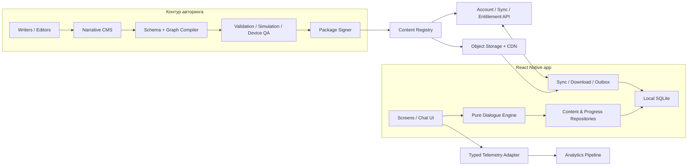
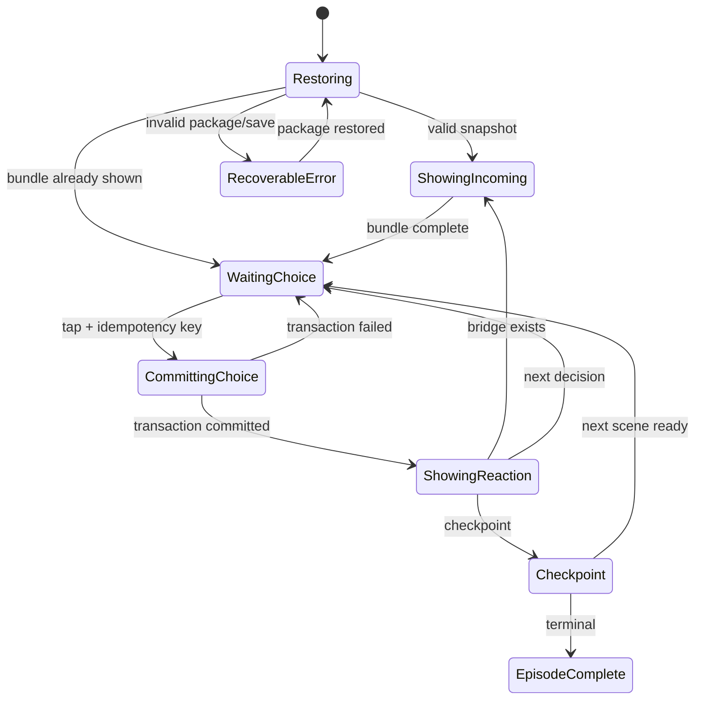

# CharTalk — Product Design Specification

**Тип документа:** Product Design Specification (PDS) / продуктово-техническая спецификация  
**Статус:** Draft 1.0 — готов к продуктовому и архитектурному ревью  
**Дата:** 12 августа 2026  
**Продукт:** мобильное приложение CharTalk для iOS и Android  
**Основной язык продукта и контента:** русский (`ru-RU`)  
**Исходное состояние:** greenfield; рабочая папка пуста, существующих ограничений реализации нет  
**Владельцы:** Product, Narrative Design, Mobile Engineering, Content Operations  

---

## 0. Статусы решений и термины

В документе используются три типа решений:

- **[ОБЯЗАТЕЛЬНО]** — зафиксированное требование. Релиз, который его нарушает, не соответствует PDS.
- **[РЕКОМЕНДАЦИЯ]** — предпочтительное решение первой реализации. Его можно заменить после документированного ревью.
- **[ОТКРЫТО]** — решение владельца продукта, которое ещё не принято. Временное предположение не считается продуктовой истиной.

Термины:

- **Реплика персонажа** — одно или несколько последовательных сообщений виртуального персонажа, после которых приложение ждёт решение игрока.
- **Точка выбора / decision node** — состояние истории, в котором показана реплика персонажа и ровно четыре доступных ответа игрока.
- **Ответ игрока / choice** — один из четырёх заранее написанных вариантов.
- **Реакция** — заранее написанная непосредственная реакция персонажа на выбранный ответ.
- **Узел** — атом графа истории: реплика, реакция, переход, пауза, checkpoint или финал.
- **Прохождение / run** — отдельная версия отношений игрока с персонажем.
- **Эпизод** — загружаемая и редакционно управляемая глава истории.
- **Пакет контента** — подписанный, версионированный набор эпизодов, текстов, правил и медиафайлов.
- **Текстовая единица** — уникальный опубликованный текст: реплика персонажа, вариант ответа или системная строка. Дубли и технические идентификаторы не увеличивают счётчик.
- **Движок диалога** — детерминированный модуль, который по состоянию прохождения и выбору вычисляет эффекты и следующий узел. Генеративные модели не участвуют.

Терминологическая политика документа: пользовательский интерфейс, редакторская CMS и инструкции для авторов используют нормальный русский язык. Английские слова сохраняются только для устойчивых инженерных понятий, имён типов/API и кодовых идентификаторов; при первом употреблении даётся русский смысл. Смешанный язык в этом PDS не является образцом речи персонажей.

## Навигация по документу

- Разделы 1–3: capability, ограничения и принципы.
- Разделы 4–8: аудитория, метрики, сценарии и UX чата.
- Разделы 9–11: narrative engine, русский стандарт и производство контента.
- Разделы 12–16: mobile/backend architecture, data, packages и sync.
- Разделы 17–21: safety, accessibility, notifications, monetization и analytics.
- Разделы 22–29: edge cases, testing, roadmap, acceptance, operations, risks и handoff.
- Разделы 30–33: traceability, редакционные и schema-примеры, glossary.

## Краткий capability contract

### CAPABILITY

Русскоязычный пользователь ведёт полностью авторскую переписку с вымышленным персонажем: на каждой точке выбирает один из четырёх ответов, получает отдельную реакцию, отдельный следующий набор ответов или финал и сохраняемое последствие. Runtime-генерации нет; загруженная история работает офлайн.

### CONSTRAINTS

- Ровно четыре видимых и enabled answers в каждом nonterminal decision state.
- Every A/B/C/D: unique visible reaction + unique next outcome + specific remembered state.
- Deterministic engine, immutable versioned content и atomic local save.
- Russian-first human editorial pipeline.
- GA gate ≥300 000 unique approved Russian text units; capacity ≥1 000 000.
- Fiction disclosure, safety controls, accessibility и no premium “correct answer”.

### IMPLEMENTATION CONTRACT

Рекомендуется local-first React Native/TypeScript app: pure dialogue engine, SQLite event log/snapshots, independently downloadable signed content shards, backend for catalog/account/validated sync/entitlements, and a separate narrative CMS/compiler. Backend подтверждает cloud history replay-ем exact signed build, но не участвует в каждом offline turn.

### NON-GOALS

Нет свободного текста, runtime AI, real-person messaging, UGC, multiplayer, therapy claims, energy/pay-per-choice или обязательного web player.

### OPEN QUESTIONS

До vertical slice нужно решить age rating, launch character/genre, protagonist model, UI `ты/вы`, `ё` policy и grace undo. Полный decision register — §28.3.

### HANDOFF

Specification ready для schema/engine/UX vertical slice; full production implementation ждёт blocking product decisions и architecture review. Первый доказательный artifact — одна законченная 100-node Russian mini-arc с counterfactual validator, native editorial rubric и kill/resume tests.

---

# 1. CAPABILITY — что создаётся

CharTalk даёт русскоязычному пользователю возможность вести визуально знакомую переписку с вымышленными персонажами и влиять на отношения и сюжет, выбирая один из четырёх заранее написанных ответов после каждой смысловой реплики. Каждый выбор немедленно или отложенно меняет состояние истории: отношение персонажа, накопленные знания, доверие, границы, активные ветки, доступные будущие ответы и финалы. Приложение не имитирует свободный разговор с ИИ и не отправляет пользовательский текст в языковую модель: история полностью авторская, воспроизводимая, тестируемая и работает офлайн после загрузки эпизода.

> **Живая переписка с характером визуальной новеллы: четыре осмысленных ответа, реальные последствия, никакой генерации на ходу.**

## 1.1. Пользовательское обещание

**[ОБЯЗАТЕЛЬНО]** Продукт обещает:

1. После каждой точки выбора есть **ровно четыре** видимых и доступных варианта.
2. Варианты отличаются не только словами: каждый выражает различимое намерение, тон, позицию, риск или действие.
3. Каждый выбор даёт уникальную немедленную реакцию персонажа, меняет полный набор из четырёх ответов в следующей точке выбора и записывает специфическое последствие в состояние; если выбор завершает арку, вместо следующего набора он ведёт к уникальному финальному исходу.
4. Персонажи помнят релевантные решения внутри прохождения и не противоречат установленным фактам.
5. Все реплики заранее написаны и отредактированы; runtime-генерации нет.
6. Основной контент звучит как естественная современная русская переписка, а не как перевод, реклама или набор романтических клише.
7. Загруженная история продолжается без сети.
8. Игрок понимает, что персонажи вымышлены, а ответы ограничены авторским сценарием.

## 1.2. Ключевая гипотеза

Ограничение до четырёх тщательно написанных ответов не уменьшает ощущение агентности, если ответы различаются по намерению, персонаж реагирует на формулировку и контекст, последствия проявляются сразу и позже, а приложение не маскирует линейность косметическими выборами.

## 1.3. Категория и позиционирование

CharTalk находится на пересечении интерактивной прозы, чат-фикшена, визуальной новеллы, relationship simulator и мобильного сериального контента.

CharTalk **не** является AI companion, мессенджером с реальными людьми, сервисом психологической помощи или приложением для знакомств.

Рекомендуемое короткое описание:

> **Выбирай, что ответить. Персонажи запомнят. История изменится.**

Поддерживающее сообщение:

> Авторские переписки на русском языке: четыре варианта ответа, десятки сюжетных последствий и никакой генерации на ходу.

Нельзя использовать в маркетинге:

- «настоящая любовь в телефоне»;
- «он понимает тебя лучше людей»;
- «идеальный партнёр, который никогда не бросит»;
- «замена психолога / друга / отношений»;
- заявления о бесконечном диалоге;
- формулировки, скрывающие авторскую и ограниченную природу ответов.

---

# 2. CONSTRAINTS — фиксированные правила и границы

## 2.1. Основные инварианты

| ID | Инвариант | Проверка |
|---|---|---|
| INV-001 | В каждой опубликованной точке выбора ровно 4 ответа | Валидатор блокирует сборку при количестве `!= 4` |
| INV-002 | Каждый ответ ведёт в существующую реакцию или терминальный узел | Проверка ссылочной целостности |
| INV-003 | Выбор обрабатывается детерминированно | Одинаковое состояние, choice ID и версия дают одинаковый результат |
| INV-004 | Ни клиент, ни сервер не вызывают LLM для реплик или переходов | Аудит зависимостей и сетевых вызовов |
| INV-005 | Принятый выбор не теряется после перезапуска | Транзакционная запись до визуального перехода |
| INV-006 | Опубликованный контент имеет неизменяемую версию | Изменение создаёт новую версию пакета |
| INV-007 | Старый run воспроизводится или безопасно мигрируется | Контракт совместимости и migration tests |
| INV-008 | Недоступный ответ не показывается как один из четырёх | Движок сначала разрешает четыре валидных слота |
| INV-009 | Эпизод работает без сети после загрузки | E2E в airplane mode |
| INV-010 | Пользовательский выбор нельзя silently заменить | Хранится точный `choiceId` и версия |
| INV-011 | Все пользовательские поверхности v1 доступны на русском | Линтер локализации |
| INV-012 | Побочные эффекты применяются ровно один раз | Idempotency key и event log |
| INV-013 | A/B/C/D дают попарно разные immediate reactions | Counterfactual test для каждого reachable state |
| INV-014 | A/B/C/D дают попарно разные следующие наборы из 4 ответов либо разные terminal outcomes | Counterfactual next-outcome signature test |
| INV-015 | Каждый choice пишет специфическую память/state и она читается downstream | Write/read payoff analysis |

## 2.2. Измеримый масштаб контента

**[ОБЯЗАТЕЛЬНО]** Архитектура поддерживает без изменения модели данных:

- минимум **1 000 000** опубликованных текстовых единиц в каталоге;
- минимум **200 000** decision nodes;
- минимум **100** персонажей;
- минимум **2 000** эпизодов;
- пакет персонажа до 250 МБ с медиа и до 50 МБ без медиа;
- локальное хранение минимум 20 000 decision nodes без заметной деградации.

**[ОБЯЗАТЕЛЬНО]** Content gate публичного General Availability:

- минимум **60 000** опубликованных decision nodes;
- минимум **60 000** уникальных реплик персонажей в точках выбора;
- минимум **240 000** уникальных ответов игрока среди fallback и условных candidates;
- итого минимум **300 000** уникальных русских текстовых единиц, не считая UI и технических дублей;
- минимум 12 полноценных персонажей;
- минимум 3 законченных арки и 5 существенно разных финалов у каждого стартового персонажа;
- 100% non-deprecated узлов статически достижимы; automated/golden traversal фактически посещает минимум 80% узлов в каждом release build, а для оставшихся редких веток compiler формирует проверяемый witness state/path.

Не считаются уникальными единицами:

- один текст, привязанный к нескольким узлам;
- различия только в пробелах, регистре, пунктуации или эмодзи;
- шаблон с разными именами;
- автоматически склонённые варианты без отдельной редактуры;
- deprecated, unreachable или draft-тексты.

Счётчики не смешиваются:

- `decisionNodeCount` — опубликованные точки выбора;
- `resolvedSlotCountBaseline` — четыре fallback-слота на node; при 60 000 nodes это 240 000 slot placements;
- `choiceCandidateCount` — все authored conditional/fallback candidates и обычно больше 240 000;
- `uniquePlayerChoiceTextCount` — уникальные surface texts ответов игрока;
- `uniqueCharacterTextCount` — уникальные реплики, reactions и bridges персонажей;
- `uniquePublishedTextUnitCount` — итог после дедупликации.

Поэтому `4 × decision nodes` описывает минимум одновременно разрешаемых слотов, а не потолок authored reply inventory. Reactions, bridges и conditional variants увеличивают фактический GA-каталог; capacity/load tests используют 1 000 000 text units, то есть запас выше обязательного минимума 300 000.

Контент — масштаб каталога, а не одного скачивания. Первый запуск включает shell, каталог и короткий стартовый эпизод. Остальное разбивается на загружаемые пакеты.

**[ОТКРЫТО до production planning]** Должны ли 300 000 единиц быть в первом store-релизе. Временное предположение: закрытая beta может стартовать с 2 000 decision nodes; релиз нельзя называть полным GA до выполнения gate.

## 2.3. Границы доверия

- Мобильный клиент считается потенциально модифицируемым.
- Сервер не доверяет присланным entitlement, цене, версии пакета или аналитическим атрибутам.
- Сервер не принимает client-computed effects, state hash или ending как авторитетные: при cloud sync он replay-ит choice IDs через канонический engine и exact signed content build.
- Пакеты подписываются; клиент проверяет подпись и checksum до активации.
- Авторская CMS и production-публикация отделены от приложения и защищены ролями.
- Персональные данные и текстовые произведения хранятся в разных контурах.
- Подмена локального прогресса не должна раскрывать чужие данные или выдавать серверные покупки.

## 2.4. Обязательный scope целевого GA v1

В этом PDS `v1` означает первый полнофункциональный General Availability release, а не vertical slice, alpha или beta. Требования без отдельной пометки применяются к GA. Более ранние фазы намеренно являются подмножествами и не должны называться завершённым v1.

- iOS и Android из единой React Native codebase;
- портретная ориентация телефона;
- русский интерфейс и русский контент;
- гостевой старт без регистрации;
- локальное прохождение и офлайн-чтение загруженного контента;
- опциональная синхронизация после входа;
- текстовые диалоги, статичные аватары и ограниченные вложения;
- четыре ответа в каждой точке выбора;
- один active choice за транзакцию;
- ручная редакционная публикация.

## 2.5. Применимость по фазам

| Capability | Vertical slice | Closed alpha/MVP | Public beta | GA v1 |
|---|---:|---:|---:|---:|
| Ровно 4 meaningful choices | Обязательно | Обязательно | Обязательно | Обязательно |
| Unique reaction + next outcome + memory | Обязательно | Обязательно | Обязательно | Обязательно |
| Russian voice/edit gates | Обязательно | Обязательно | Обязательно | Обязательно |
| Local atomic save | Обязательно | Обязательно | Обязательно | Обязательно |
| Bundled/offline sample | Обязательно | Обязательно | Обязательно | Обязательно |
| Downloadable packages/rollback | Fixture only | Обязательно | Обязательно | Обязательно |
| Catalog/archive/settings | Prototype | Обязательно | Обязательно | Обязательно |
| Content warnings/safe routes | Test fixture | Обязательно | Обязательно | Обязательно |
| Guest mode | Обязательно | Обязательно | Обязательно | Обязательно |
| Optional account/cloud sync | Не входит | Не входит по умолчанию | Pilot только если OQ-11 принят | Условно обязательно: либо реализовано, либо исключено explicit PDS decision |
| Multi-device conflict branching | Не входит | Не входит | Если sync pilot | Если accounts/sync входят |
| Entitlements/payments | Не входит | Не входит | Только отдельный approved pilot | Только если monetization входит |
| 300 000 text-unit gate | Не применяется | Не применяется | Ramp metric | Обязательно для полного GA label |
| 1 000 000-unit capacity test | Schema fixture | Compiler test recommended | Обязательно | Обязательно |

Acceptance criteria, относящиеся к условной capability (`sync`, payments, notifications), помечаются `N/A` только письменным phase decision с owner. Core dialogue, Russian quality, offline sample, save integrity, safety и accessibility нельзя исключить как `N/A`.

## 2.6. NON-GOALS

В базовую версию не входят:

- свободный ввод сообщения;
- распознавание речи или голосовой разговор;
- генерация текста, изображений или голоса в runtime;
- общение игроков между собой;
- публичные профили, лайки и социальная лента;
- пользовательские сценарии и marketplace;
- real-time multiplayer;
- AR/VR и 3D-сцена;
- обязательный web-клиент для игроков;
- терапевтические или медицинские обещания;
- рекламная персонализация по содержанию истории;
- продажа ответа как единственно «правильного» морального выбора.

---

# 3. Продуктовые принципы

1. **Конкретика вместо псевдоглубины.** Персонаж помнит опоздание на встречу, а не произносит «ты изменила мою вселенную».
2. **Ответ — это действие.** Вариант сообщает намерение: поддержать, уточнить, отстраниться, пошутить, соврать, признаться, поставить границу.
3. **Персонаж не обслуживает игрока.** У него есть расписание, друзья, взгляды и право не согласиться.
4. **Последствия читаемы, но это не таблица оптимизации.** Игрок видит реакцию, не обязательный числовой «счёт любви».
5. **Никакого ложного ИИ.** Ограничения формата не прячутся.
6. **Русский пишется сразу по-русски.** Не переводим синтаксис и шутки из англоязычного шаблона.
7. **Мобильный ритм важнее литературного самолюбования.** Один пузырь — одна ясная мысль или намеренная пауза.
8. **Редкость заслужена.** Скрытая сцена открывается понятной совокупностью решений, а не случайностью.
9. **Офлайн — нормальный режим.** Сеть нужна для контента и sync, не для каждого ответа.
10. **Контент — исполняемый продукт.** Он версионируется, валидируется, тестируется и откатывается как код.

---

# 4. Цели, антицели и метрики

## 4.1. Цели v1

| ID | Цель | Измеримый результат |
|---|---|---|
| G-01 | Доказать агентность четырёх ответов | ≥70% beta-пользователей согласны: «мои ответы заметно влияли на разговор» |
| G-02 | Упростить старт | Медиана от первого открытия до первого выбора ≤90 секунд |
| G-03 | Создать желание вернуться | D7 retention — целевой ≥20% для органической когорты; уточнить после beta |
| G-04 | Поддержать масштаб | GA gate выполнен; разрешение следующего узла p95 ≤50 мс локально |
| G-05 | Добиться живого русского текста | ≥85% blind-review без оценки «переводно/натужно»; cringe-rate <3% |
| G-06 | Не терять прогресс | <0,1% сессий с recovery; 0 известных случаев silent loss выбора |
| G-07 | Работать офлайн | 100% загруженных эпизодов проходимы без сети |
| G-08 | Управлять производством | У каждого узла есть owner, история изменений, проверки и воспроизводимая сборка |

## 4.2. North Star Metric

**Meaningful Choices per Weekly Active Reader (MC/WAR)** — число подтверждённых выборов в неделю на пользователя, начавшего хотя бы один эпизод. Считаются только уникальные decision nodes основного прохождения после успешной записи события.

Guardrails:

- рост MC/WAR не должен снижать completion rate;
- нельзя дробить одну мысль на лишние точки;
- paywall, перечитывание и технический повтор не считаются;
- событие засчитывается только после commit.

## 4.3. Воронка и обязательные показатели

Воронка:

1. Первый запуск.
2. Просмотр обещания формата.
3. Выбор персонажа.
4. Начало пролога.
5. Первый выбор.
6. Пять выборов.
7. Завершение сцены.
8. Завершение эпизода.
9. Возврат на следующий день.
10. Второй эпизод или второй персонаж.
11. Завершение арки.
12. Replay или новая ветка.

Измерять:

- `first_choice_conversion` и `five_choice_conversion`;
- `scene_completion_rate` и `episode_completion_rate`;
- median choices и duration per session;
- D1/D7/D30 retention;
- start-to-finish по персонажу и эпизоду;
- долю replay;
- распределение выбора по позиции 1–4 и смысловому тегу;
- немедленный rewind после выбора;
- контентные ошибки на 1 000 прохождений;
- download success rate и time-to-play;
- crash-free и ANR-free sessions.

## 4.4. Метрики качества истории

- **Choice differentiation:** четыре разных намерения подтверждены редактором минимум у 98% точек.
- **Callback density:** минимум один содержательный callback на прошлый выбор на каждые 15 decision nodes, когда контекст допускает.
- **Consequence latency:** 100% choices имеют попарно различимую немедленную реакцию и изменяют следующий choice-set signature либо terminal outcome; ≥15% также имеют существенное отложенное последствие в текущем или следующем эпизоде.
- **Branch significance:** ≥20% decision nodes влияют не только на ближайшую реплику, но и на state, flag, будущий узел или финал.
- **Dead-choice rate:** 0%. Косметические варианты, не меняющие реакцию, следующий набор/terminal outcome и specific state, не публикуются.
- **Voice consistency:** ≥90% редакционной выборки узнаётся как нужный персонаж без подписи.
- **Duplicate rate:** точные дубли <0,5% без `intentionalRepeatId`; near-duplicates проверяются вручную.

Нельзя без guardrails оптимизировать время в приложении, число push-уведомлений, streak, выручку или эмоциональную интенсивность. Удержание не оправдывает тревожность, чувство вины или продажу «правильного» ответа.

---

# 5. Аудитория, потребности и контекст

## 5.1. Основной сегмент

Русскоязычные пользователи 16–34 лет, которым нравятся переписки, сериалы, фанфикшен, визуальные новеллы, интерактивные истории или character-driven игры, но которые не обязательно называют себя геймерами.

**[ОТКРЫТО до age-rating review]** Минимальный возраст. Предположение — 16+; откровенный сексуальный контент, тяжёлая жестокость и эксплуатация уязвимости не входят в core v1. Каталог 18+ потребует отдельного policy, age gate, store review и фильтрации.

## 5.2. Персоны

### A. «Читаю по дороге»

- Заходит на 3–10 минут в транспорте или перед сном.
- Хочет быстро начать и не писать текст с нуля.
- Уйдёт, если первые четыре ответа кажутся одинаковыми.

### B. «Охотник за ветками»

- Переигрывает эпизоды, собирает финалы, обсуждает решения.
- Хочет видеть реальные развилки без спойлеров.
- Быстро обнаруживает fake choices и continuity errors.

### C. «Пришла из переписок»

- Не знакома с визуальными новеллами, но понимает интерфейс мессенджера.
- Ждёт естественной скорости, статусов и коротких сообщений.
- Может принять fiction UI за настоящий чат, если disclosure спрятан.

### D. «Читатель жанра»

- Выбирает детектив, романтику, драму, комедию или мистику, а не абстрактный продукт.
- Нужны понятные tags, tone и content warnings.
- Покидает историю, если жанровое обещание не совпало с аркой.

## 5.3. Jobs to Be Done

> Когда у меня есть несколько свободных минут и хочется эмоционально включиться в историю, я хочу быстро открыть знакомую переписку и выбрать, как ответить персонажу, чтобы увидеть последствия без необходимости сочинять сообщение с нуля.

Дополнительные jobs:

- проверить другой стиль общения;
- вернуться ровно к месту остановки;
- найти нужную динамику без спойлеров;
- сравнить альтернативы после главы;
- скачать эпизод дома и читать без связи.

## 5.4. Контексты использования

- нестабильная сеть;
- одна рука и короткая сессия;
- без звука или в тёмной комнате;
- прерывание звонком;
- возвращение через несколько дней;
- несколько активных историй;
- новый телефон;
- мало свободного места;
- screen reader и увеличенный текст.

---

# 6. Информационная архитектура

## 6.1. Карта продукта

```text
Запуск
├── Первый запуск
│   ├── Обещание формата и fiction disclosure
│   ├── Возраст / предупреждения
│   ├── Имя и форма обращения
│   └── Выбор первого персонажа
├── Истории
│   ├── Продолжить
│   ├── Новые эпизоды
│   ├── Каталог персонажей
│   └── Загружено
├── Карточка персонажа
│   ├── Описание, жанры, предупреждения
│   ├── Прогресс / финалы
│   └── Начать / продолжить / скачать
├── Чат
│   ├── Лента сообщений
│   ├── Четыре ответа
│   ├── Вложения
│   └── Сводка главы
├── Архив
│   ├── Активные runs
│   ├── Завершённые арки
│   ├── Финалы
│   └── Replay
└── Настройки
    ├── Аккаунт и sync
    ├── Текст, тема, звук, вибрация
    ├── Уведомления
    ├── Контент и хранилище
    ├── Конфиденциальность
    └── Поддержка
```

## 6.2. Навигация

**[РЕКОМЕНДАЦИЯ]** Нижняя панель из трёх пунктов:

1. **Истории** — главная, продолжение и каталог.
2. **Архив** — активные и завершённые прохождения.
3. **Настройки** — профиль, доступность, загрузки и приватность.

Чат открывается отдельным экраном без tabs. Deep link ведёт на карточку, эпизод или безопасную точку продолжения, но не перескакивает обязательное сюжетное состояние.

## 6.3. Главная

Приоритет сверху вниз:

1. Последний run «Продолжить».
2. Новые главы начатых историй.
3. Выбрать персонажа.
4. Подборки по жанру и динамике: «детектив», «медленное сближение», «дружба», «соперничество», «мрачная тайна», «ироничная комедия».
5. Загружено для офлайн.

Запрещены autoplay, фальшивое «онлайн», badges без реального события, скрытые age warnings и чувствительная психологическая персонализация.

## 6.4. Карточка персонажа

Обязательные данные:

- имя, портрет и возраст либо однозначная маркировка совершеннолетия;
- hook до 160 знаков и описание до 600;
- жанры, тип динамики и ориентировочная длительность;
- статус арки: завершена / выходит / мини-история;
- content warnings с раскрываемыми деталями;
- размер загрузки и offline status;
- прогресс run и число найденных финалов без скрытых названий;
- CTA «Начать», «Продолжить», «Скачать» или «Новая попытка».

Карточка не гарантирует романтику, если ветка зависит от выбора. Корректно: «отношения могут стать ближе»; некорректно: «он обязательно влюбится».

---

# 7. Сквозные пользовательские сценарии

## 7.1. Первый запуск

Цель — первый содержательный выбор за ≤90 секунд.

1. Splash выполняет только техническую инициализацию.
2. Экран обещания: «Выбирай один из четырёх ответов. Персонажи запомнят решения, и история изменится».
3. Видимая пометка: «Все реплики написаны заранее. Это интерактивная история, не чат с человеком и не ИИ».
4. Пользователь вводит отображаемое имя или пропускает.
5. Выбирает грамматическую форму обращения: мужской род, женский род, нейтральные формулировки. Это не называется обязательным выбором пола.
6. Видит 3–5 разных стартовых персонажей.
7. Открывает preview и начинает пролог.
8. Пролог входит в приложение или уже загружен.
9. Первая реплика приводит к четырём ответам.
10. После выбора показывается конкретная реакция; объяснение механики не прерывает сцену длинным tutorial overlay.

Acceptance criteria:

- регистрация не нужна;
- Back/close не стирает введённые данные;
- screen reader сообщает «вариант 1 из 4»;
- при нейтральном профиле нет случайного рода;
- без сети доступен полный стартовый эпизод;
- первый набор не состоит из четырёх оттенков согласия.

## 7.2. Основной цикл чата

1. Движок восстанавливает snapshot и проверяет версию пакета.
2. UI показывает заданную серию сообщений персонажа.
3. На decision node движок разрешает четыре choice slots.
4. UI показывает ровно четыре ответа.
5. Tap даёт pressed state; выбор исполняется при отпускании внутри target.
6. Подтверждение используется только для необратимого, платного или финального решения.
7. Одна локальная транзакция пишет событие, effects, новый snapshot и sync outbox.
8. Только после commit ответ появляется пузырём игрока.
9. Движок показывает реакцию и bridge-сообщения.
10. На следующем decision node появляются новые четыре ответа.
11. Background/kill не повторяет effects.

Выбор считается валидным, только если одновременно: (1) его immediate reaction попарно отличается от реакций остальных трёх choices; (2) полный набор четырёх ответов в следующей точке попарно отличается либо choice приводит к уникальному terminal outcome; (3) записывается специфическая state/memory-причина, читаемая позднее или финальным epilogue. Изменение сцены, отношений и knowledge — дополнительные уровни влияния. Косметических исключений нет.

## 7.3. Пауза и возвращение

- Выход разрешён в любой момент.
- Последний committed choice сохраняется немедленно.
- Для серии сообщений хранится индекс показа.
- «Продолжить» показывает последнюю безопасную реплику без спойлера.
- Персонаж не обвиняет пользователя за отсутствие, если это не раскрытая сюжетная механика.
- После ≥7 дней может быть кнопка «Коротко: что происходило»; summary заранее написан для checkpoint.

## 7.4. Завершение эпизода

Сводка показывает название главы, 2–4 ключевых решения нейтральным языком, найденные факты, качественные изменения отношений и CTA «Продолжить», «В архив», «Посмотреть развилки».

Развилки по умолчанию показывают только посещённые узлы и силуэты крупных веток. Полное дерево можно открыть после первого финала.

## 7.5. Rewind и Replay

- **Rewind** возвращает к checkpoint и создаёт новую ветвь журнала.
- **Replay** создаёт независимый `runId`.
- Нельзя удалить одно событие из середины и оставить последующие.
- Возврат сообщает объём переигрывания без спойлера.
- Коллекционные финалы привязаны к профилю, не к одному run.
- Hidden state не переносится, кроме специально объявленных meta flags.
- **[ОТКРЫТО]** Нужен ли бесплатный grace undo 3–5 секунд после случайного tap.

## 7.6. Новый телефон и sync conflict

1. После входа клиент получает runs и compatible versions.
2. Нужные пакеты загружаются.
3. Event log replay-ится до snapshot.
4. Два разных продолжения одного run не склеиваются: сохранить оба как ветки либо выбрать каноническую.
5. Ни одна ветка не удаляется без подтверждения.

---

# 8. UX-спецификация чата

## 8.1. Компоновка

1. Safe area.
2. Header: back, avatar, имя, нейтральный статус истории, menu.
3. Виртуализированная лента.
4. Авторский typing/pause indicator, только когда задан сценарием.
5. Разделитель зоны выбора.
6. Четыре вертикальные кнопки ответа.
7. Нижняя safe area.

Допустимый статус: «глава 2», «вечер, кухня», короткое «печатает…». Запрещены фальшивые «онлайн» и «был 5 минут назад».

## 8.2. Сообщения

- Рекомендуемая длина пузыря ≤240 знаков, hard limit 500.
- Обычно 1–4 пузыря перед выбором; >6 требует обоснования.
- Действия оформляются единообразной narrative card или ремаркой, не случайными `*звёздочками*`.
- Время показывается только при сюжетном смысле или по accessibility request.
- Ссылки открываются безопасно.
- У изображения есть alt text; важная информация не существует только в картинке.

## 8.3. Четыре ответа

- Все четыре видны одновременно при стандартном размере текста и длине ≤110 знаков.
- При крупном шрифте зона прокручивается и сообщает общее число.
- Touch target минимум 44×44 pt.
- Текст слева; смысл не скрывается многоточием.
- Четвёртый ответ нельзя прятать за horizontal scroll.
- После отправки все блокируются синхронно.
- Double tap создаёт одно событие благодаря idempotency key.
- Порядок авторский и не shuffle-ится; аналитика отслеживает position bias.

## 8.4. Ритм и motion

- Default reaction мгновенная.
- Декоративная задержка обычно 150–900 мс, максимум 3 секунды без сюжетной причины.
- Настройка «Уменьшить паузы» сокращает задержки до 0–100 мс.
- При Reduce Motion нет пружинящих или масштабных анимаций.
- Tap может раскрыть всю текущую серию, но не перескочить выбор.
- Длинное «печатает…» не имитирует реального человека.

## 8.5. Ошибки

| Ситуация | Поведение |
|---|---|
| Нет сети, эпизод загружен | Продолжить; sync events ждут в outbox |
| Следующий эпизод не загружен | Закончить текущий; предложить скачать позже |
| Пакет повреждён | Откатить к last-known-good или перекачать |
| Commit не удался | Не показывать отправку; дать повторить |
| Kill после commit до анимации | Восстановить ответ и продолжить без повторного effect |
| Узел отсутствует | Остановиться на safe checkpoint; не угадывать переход |
| Не разрешились 4 ответа | Content fatal, откатить пакет |
| Sync conflict | Продолжить локально отдельной веткой |

## 8.6. Визуальный язык

Не копировать известный мессенджер пиксель в пиксель. Использовать знакомую грамматику и собственную идентичность: спокойный фон, один акцентный цвет персонажа, хорошая кириллица, dark theme, минимум декоративных эффектов и медиа только с сюжетной функцией.

---

# 9. Narrative Design — модель истории

## 9.1. Иерархия контента

```text
Catalog
└── Character
    └── Season / major storyline
        └── Arc
            └── Episode
                └── Scene
                    ├── Decision node
                    ├── Reaction node
                    ├── Bridge node
                    ├── Checkpoint
                    └── Terminal node
```

- **Catalog** — опубликованный набор пакетов и общих schemas.
- **Character pack** — независимо загружаемый и версионируемый контент персонажа.
- **Arc** — драматический вопрос: уйдёт ли герой с работы, восстановится ли дружба, будет ли раскрыта ложь.
- **Scene** — короткий разговор с начальным контекстом и явными exit conditions.
- **Decision node** — сообщения персонажа плюс четыре ответа.
- **Reaction node** — уникальная реакция на конкретный choice; может перейти дальше автоматически.
- **Bridge node** — сообщения персонажа между реакцией и следующим выбором.
- **Checkpoint** — безопасная точка сохранения и миграции без частично применённых effects.
- **Terminal node** — конец эпизода или арки; искусственные четыре ответа не нужны.

## 9.2. Граф вместо дерева

История — stateful directed graph. Чистое дерево из четырёх веток растёт как `4^n` и непригодно уже через несколько решений. Допустимый паттерн:

```text
Общий decision node
├── A → уникальная реакция A ┐
├── B → уникальная реакция B ├── общий сюжетный beat
├── C → уникальная реакция C ┤   с memory-aware текстом и choices
└── D → уникальная реакция D ┘
```

Reconvergence разрешён, только если:

1. Immediate reaction различается.
2. Записана специфическая память о выбранном намерении/факте.
3. Общий beat не противоречит ни одной ветке.
4. Минимум один будущий текст, ответ или переход читает эту память.
5. Важный выбор получает payoff не позднее обещанного narrative window.

Рекомендуемая формула: **branch → react → remember → reconverge → callback**.

Длинные независимые ветки резервируются для поворотных решений. Небольшие решения расходятся на реакцию и варианты следующего набора, затем могут сходиться вокруг внешнего события: начинается собеседование, приходит поезд, звонит третий персонаж, заканчивается вечер.

## 9.3. Классы состояния

### Отношения, целые числа 0–100

- `trust` / доверие — готовность раскрывать сомнения и чувствительные факты.
- `closeness` / близость — стремление к контакту и тёплой речи.
- `respect` / уважение — серьёзность отношения к позиции игрока, даже при несогласии.
- `tension` / напряжение — нерешённое раздражение, конфликт, защитная реакция.
- `romanticInterest` — только у взрослых персонажей с утверждённой романтической аркой; это не универсальная метрика победы.

Измерения независимы. Прямой спор может повысить `respect` и `tension`; шутка — `closeness`, но не `trust`. Обычный ответ не должен давать очевидные «+5 сердечек».

Для авторинга могут использоваться derived tiers:

| Диапазон | Внутренний tier | Пример поведения |
|---|---|---|
| 0–24 | `guarded` | коротко отвечает, не делится личным |
| 25–49 | `cautious` | продолжает контакт, проверяет границы |
| 50–74 | `open` | обсуждает сомнения, признаёт ошибки |
| 75–100 | `very_close` | инициирует сложные разговоры, доверяет риск |

Для долгоживущих режимов использовать hysteresis: например, вход в `open_confiding` при trust ≥70, выход при <65, чтобы один малый delta не переключал голос туда-обратно.

### Прочие классы

- **Scene-local:** настроение, стресс, энергия, тема, присутствующие лица. Сбрасываются только на объявленной границе.
- **Arc state:** стадия арки, milestones, открытые сцены.
- **Specific memories:** сказанное, узнанное, скрытое, обещанное, высмеянное, отвергнутое.
- **Promises:** структурированные обязательства `open | kept | broken | released`.
- **Knowledge:** факты, которые персонаж и игрок вправе знать.
- **Player-style counters:** наблюдаемые паттерны `supportive`, `direct`, `practical`, `evasive`, `humorous`; это не психологический диагноз.
- **Inventory/evidence:** только для жанров, где предметы или улики влияют на разговор.
- **Cooldowns:** в ходах, а не по wall-clock, если реальное время явно не записано в save.
- **History:** visited nodes, choice IDs, финалы, applied event IDs.

Числовой score никогда не заменяет память. `trust = 56` не сообщает, что игрок пообещал не рассказывать матери Иры об увольнении.

## 9.4. Декларативные условия и эффекты

Контент не исполняет произвольный JavaScript. Разрешён малый типизированный DSL:

```ts
type Condition =
  | { op: 'all'; args: Condition[] }
  | { op: 'any'; args: Condition[] }
  | { op: 'not'; arg: Condition }
  | {
      op: 'compare';
      path: string;
      cmp: 'eq' | 'neq' | 'lt' | 'lte' | 'gt' | 'gte';
      value: string | number | boolean;
    }
  | { op: 'hasMemory'; key: string; value?: string | number | boolean }
  | { op: 'chosen'; choiceId: string }
  | { op: 'seen'; nodeId: string }
  | { op: 'withinLastTurns'; choiceId: string; turns: number };

type Effect =
  | { op: 'set'; path: string; value: string | number | boolean }
  | { op: 'increment'; path: string; by: number; min: number; max: number }
  | { op: 'addMemory'; key: string; value: string | number | boolean }
  | { op: 'removeMemory'; key: string }
  | { op: 'addPromise'; promiseId: string }
  | { op: 'resolvePromise'; promiseId: string; outcome: 'kept' | 'broken' | 'released' }
  | { op: 'advanceArc'; arcId: string; phase: string }
  | { op: 'startCooldown'; cooldownId: string; turns: number };
```

Правила DSL:

- Каждый `path` объявлен в schema пакета и type-checks.
- Числа целые и clamped к допустимому диапазону.
- Effects применяются атомарно.
- `onEnter` имеет idempotency key.
- Conditions не читают случайность, сеть, undeclared device data или текущее время.
- Effect обязан иметь downstream consumer; orphan effects блокируют публикацию.
- Даже при изменении score choice пишет специфическую memory для семантической причинности.

## 9.5. Модель ровно четырёх слотов

Decision node содержит `ChoiceSlot` 1–4. В каждом слоте есть условные candidates и один безусловный fallback:

```json
{
  "slot": 2,
  "candidates": [
    {
      "choiceId": "choice.ira.work.03.d012.practical_callback",
      "textId": "text.ru.ira.004281",
      "intent": "practical_help",
      "priority": 100,
      "when": {
        "op": "hasMemory",
        "key": "memory.ira.work.reply_mode",
        "value": "practical"
      },
      "effects": [],
      "nextNodeId": "node.ira.work.03.reaction_018"
    },
    {
      "choiceId": "choice.ira.work.03.d012.practical_default",
      "textId": "text.ru.ira.004282",
      "intent": "practical_help",
      "priority": 0,
      "when": { "op": "all", "args": [] },
      "effects": [],
      "nextNodeId": "node.ira.work.03.reaction_019"
    }
  ]
}
```

Алгоритм разрешения:

1. Загрузить immutable snapshot и active node.
2. Разрешить message variant по snapshot.
3. Для каждого слота 1–4 проверить candidates против **одного и того же** snapshot.
4. Взять единственный eligible candidate с максимальным priority.
5. Equal-priority overlap считать compile error.
6. Требовать fallback в каждом слоте.
7. Проверить непустые, enabled и семантически разные тексты.
8. Отобразить в авторском порядке без shuffle.
9. При tap проверить ожидаемый `stateSequence`.
10. В одной транзакции применить effects, transition, event log, transcript и snapshot.
11. Разрешить reaction node уже по новому state.

Runtime не рандомизирует порядок. Writers сознательно меняют позиции supportive/direct/humorous ответов, чтобы не возникло правила «верхний всегда хороший».

## 9.6. Инварианты choice set

Для каждого достижимого состояния:

- разрешаются ровно четыре enabled slots;
- normalized texts различны;
- не все четыре имеют один intent;
- каждый ведёт в валидную реакцию;
- каждый пишет choice-specific memory;
- immediate reactions попарно различны;
- не позднее следующей точки меняется полный visible/semantic signature четырёх ответов либо достигается уникальный terminal outcome;
- нет filler-варианта `…`;
- terminal node не показывает искусственный выбор;
- locked, disabled и premium reply не считаются одним из четырёх.

Counterfactual test стартует из одного snapshot, отдельно применяет A/B/C/D и сравнивает:

```text
immediateReactionSignature(choice_i)
nextOutcomeSignature(choice_i)
resultingStateHash(choice_i)
```

Immediate reaction signatures, next-outcome signatures и state hashes должны быть попарно различны. Косметических исключений нет.

Signature строится не только по IDs:

```text
immediateReactionSignature = ordered(normalized visible Russian texts + meaningful authored action/media semantics)
nextOutcomeSignature = either ordered(normalized visible reply text + intent tag + transition semantics) × 4, or terminal ending ID + normalized epilogue signature
```

Уникальные IDs при одинаковом видимом тексте не доказывают влияние. Разница только в пробеле, регистре, типе кавычек, `е/ё`, декоративном emoji или пунктуации также не считается. Минимум одна фраза/intent в следующем наборе должна содержательно отличаться, а весь набор проходит human semantic review. Terminal outcome — единственное логическое исключение из требования следующего набора; он обязан иметь отдельный ending/epilogue, а не просто обрывать чат.

## 9.7. Переходы

```json
{
  "transitions": [
    {
      "priority": 100,
      "when": {
        "op": "compare",
        "path": "relationships.char.ira.trust",
        "cmp": "gte",
        "value": 70
      },
      "nextNodeId": "node.ira.work.03.open_variant"
    },
    {
      "priority": 0,
      "when": { "op": "all", "args": [] },
      "nextNodeId": "node.ira.work.03.cautious_variant"
    }
  ]
}
```

- Победитель ровно один.
- Default обязателен, кроме terminal.
- Same-priority overlap — ошибка сборки.
- Цикл допустим, только если меняет факт/счётчик/cooldown и имеет доказуемый exit.
- Automatic chain имеет hard hop limit.
- Один initial state + content build + ordered choices всегда дают одинаковые transcript и state hash.

## 9.8. Архитектура последствий

У каждого значимого выбора narrative designer заполняет consequence card:

| Поле | Смысл |
|---|---|
| Intent | Что игрок пытается сделать |
| Immediate read | Как персонаж воспринимает фразу сейчас |
| State write | Scores, memory, promise, knowledge |
| Short payoff | Видимый эффект в 1–3 следующих choices |
| Long payoff | Callback/ветка до конца эпизода или сезона |
| Failure mode | Как избежать противоречия при reconvergence |
| Expiry | Когда память разрешено закрыть или забыть |
| Safety impact | Не ведёт ли выбор к нежелательной coercion |

Latency:

- small choice: immediate reaction + option-set difference в следующей точке;
- medium choice: payoff в пределах сцены или трёх decisions;
- pivotal choice: immediate acknowledgement и долгий payoff до финала;
- promise: статус обязательно закрывается или явно переносится в следующую арку.

## 9.9. Финалы

- Финал определяется сочетанием milestones, memories, promises и relationship tiers, а не одним score.
- Минимум пять финалов персонажа должны отличаться отношениями, раскрытыми фактами и эпилогом, а не заголовком.
- Не каждый финал романтический или «лучший».
- Не использовать моральную оценку `S/A/B` и «неправильный ответ» по умолчанию.
- После финала показываются несколько ключевых причин, но hidden variables не раскрываются полностью до optional completionist mode.
- Ongoing season сохраняет прежний финал как завершение сезона, а не переписывает его задним числом.

## 9.10. Реальное время

**[РЕКОМЕНДАЦИЯ v1]** Сюжет не заставляет ждать часы или дни. Если позже появятся real-time события:

- ожидание раскрывается до старта истории;
- timestamp записывается как явное event, а не читается непредсказуемо;
- смена timezone не ломает ветку;
- доступен accessibility/paid-neutral skip без преимущества за оплату;
- ожидание не становится energy mechanic.

---

# 10. Русский язык и anti-cringe стандарт

## 10.1. Политика исходного языка

- Финальный текст пишется или существенно переписывается свободно владеющими русским авторами.
- Русский — исходный язык, а не переводной слой.
- У строки указаны конкретные автор и русскоязычный редактор.
- Генерация или paraphrase на устройстве отсутствуют.
- Если внутренние инструменты помогают с черновиками, такой текст проходит полный человеческий цикл; **[ОТКРЫТО]** разрешена ли generative assistance вообще как редакционная policy.
- Редактор читает transcript целиком, не изолированные строки в таблице.

## 10.2. Языковая база

Default — современный, регионально нейтральный разговорный русский, понятный широкой русскоязычной аудитории. Региональные слова, профессиональный jargon, интернет-сленг и code-switching имеют причину в character bible.

Естественные инструменты, а не обязательный словарь:

- «да ну»;
- «не к спеху»;
- «как назло»;
- «дело не в этом»;
- «не бери в голову»;
- «если честно»;
- «без понятия»;
- «руки не дошли»;
- «голова кругом»;
- «мне не по себе»;
- «само собой»;
- «вроде нормально»;
- «не хочу сейчас гадать»;
- «не вопрос»;
- «перебор»;
- «разберёмся».

Идиома уместна, если так действительно говорит персонаж. Механическое распределение «русских выражений» делает текст менее живым.

## 10.3. Character voice bible

Для каждого персонажа обязательна версионируемая карточка голоса (`voice card`):

- возраст и статус adult/minor;
- регион и социальная среда;
- образование, профессия, круг общения;
- `ты/вы` и условия перехода;
- длина фраз и пузырей;
- прямота, конфликт, извинение;
- тип юмора;
- привычные речевые маркеры и слова-паразиты;
- слова и конструкции, которые персонаж не использует;
- emoji, stickers, регистр и punctuation;
- profanity level;
- профессиональная и региональная лексика;
- один длинный пузырь или серия коротких;
- темы, где речь меняется;
- как звучат страх, злость, ложь, близость и усталость;
- минимум 20 примеров «в голосе» и 20 контрпримеров с объяснением дефекта;
- контрастные пары одной мысли в удачной и неудачной формулировке;
- речь с другом, начальником, незнакомым человеком и близким собеседником;
- допустимые оговорки, ошибки, недоговорённость и смена регистра;
- максимальная частота характерных слов, чтобы привычка не стала catchphrase;
- дата проверки slang/профессиональной и региональной лексики.

Голос создаётся синтаксисом, вниманием и поведением, а не повторяемой catchphrase.

## 10.4. Anti-cringe запреты

Есть два уровня контроля.

**Жёсткие запреты:** противоречие установленным фактам/голосу, неразмеченная морфологическая склейка, случайная смена `ты/вы`, exposition известных обоим фактов, четыре парафраза одного intent, эксплуатация уязвимости и переводная калька, которую персонаж не мог бы естественно произнести.

**Контекстные риск-маркеры:** следующие фразы не запрещены сами по себе, но блокируются при шаблонном повторе, незаслуженной эмоциональной близости или несоответствии голосу:

- «Я всегда буду рядом, что бы ни случилось»;
- «Спасибо, что поделился со мной»;
- «Я слышу тебя»;
- «Ты такая сильная»;
- «Вот это сюжетный поворот»;
- преждевременных ласковых прозвищ;
- постоянных риторических вопросов;
- психотерапевтические формулы от персонажа без такого речевого опыта;
- чрезмерных многоточий, эмодзи и восклицательных знаков;
- `краш`, `вайб`, `жиза`, `рил`, `буквально я` без age/subculture reason;
- exposition, которую оба собеседника уже знают;
- литературных монологов, замаскированных под чат;
- шуточного четвёртого ответа в каждой сцене;
- начала почти каждой строки с «ну», «короче» или «слушай»;
- автоматического «ты/вы» без narrative transition;
- «мурашки», «наши души встретились», «ты видишь меня настоящую» как универсального shortcut к близости.

| Натянуто | Естественнее в подходящем контексте |
|---|---|
| «Я понимаю твои чувства.» | «Сначала полегчало, а дома уже накрыло?» |
| «Я всегда рядом, моя хорошая.» | «Если не уснёшь — звони.» |
| «Ты очень сильная, я горжусь тобой.» | «Три месяца с этим ходила и всё-таки решилась.» |
| «Ого, вот это сюжетный поворот!» | «Ничего себе. Ты давно это решила?» |

Правая колонка — не универсальные «правильные шаблоны». Она показывает переход от общего заявления к конкретной детали. В чужом голосе даже эти формулировки могут быть натянутыми.

## 10.5. Морфология, имя и обращение

- Профиль: `masculine`, `feminine`, `neutralPhrasing`.
- Neutral mode использует полноценные нейтральные конструкции, не `пришёл/пришла`.
- Автоматически угадывать склонение имени нельзя.
- Имя вставляется в безопасной позиции: «Слушай, {{name}}», если declension profile не задан.
- Для обязательного падежа хранится редакционно подтверждённый набор форм.
- Смена профиля действует на будущий текст; уже показанный transcript frozen.
- Character может перейти с `вы` на `ты` только через объявленную story transition.
- Ни имя, ни grammatical profile не отправляются как analytics properties.

## 10.6. Редакционный стандарт, который нужно зафиксировать до первого пакета

- Использование `ё`: рекомендация — всегда ставить в редакционном и повествовательном тексте; character-specific omission допустимо только осознанно.
- Русские кавычки `«…»` в narrative cards.
- Оконечная точка в коротком сообщении может опускаться по карточке голоса.
- Мат и masking зависят от rating; runtime-замена букв звёздочками не используется вместо authored safe variant.
- Формат времени — 24 часа; даты — локализованные.
- Транслитерация иностранных имён закрепляется в glossary.
- Намеренные опечатки персонажа размечаются `intentionalTypo`, чтобы report не считался дефектом.
- Emoji/sticker vocabulary задаётся на персонажа.

Все перечисленные правила становятся blocking до статуса `graph_ready` первого production-кандидата. Решения делятся на:

| Автоматически проверяемые | Требующие редактора |
|---|---|
| Slash-формы рода, placeholders, Unicode/quotes, запрещённые символы | Уместность `ё`/пунктуации как особенности персонажа |
| Необъявленная смена `ты/вы` по metadata | Естественность самой точки перехода |
| Неразмеченная намеренная опечатка | Правдоподобие ошибки в голосе |
| Лимиты длины, repeated punctuation/emoji thresholds | Ритм и эмоциональная функция |
| Glossary spelling и foreign-name variants | Уместность заимствования |
| Profanity category против rating metadata | Художественная необходимость и соразмерность |

Пока OQ-15 не закрыт, первый vertical slice не использует мат. Это не позволяет отложить общий profanity policy перед первым публичным пакетом.

## 10.7. Длина и ритм текста

- Preferred character bubble: 15–160 знаков.
- Жёсткий максимум: 500; текст длиннее 360 знаков требует отдельного согласования.
- Preferred choice: 10–100 знаков.
- Hard maximum choice: 180.
- Более трёх последовательных bubbles — осознанная ритмическая причина; >6 — блокирующее предупреждение.
- Нельзя дробить абзац на восемь bubbles ради статистики.
- Каждый эмоционально важный transcript читается вслух редактором.

## 10.8. Полный пример ветки

Персонаж Ира:

> Я всё-таки уволилась. Сегодня. Пока шла до метро — будто отпустило, а дома накрыло. Маме пока не говорила.

| Ответ игрока | Скрытый эффект | Реакция Иры | Изменение следующего набора |
|---|---|---|---|
| «Тебе сейчас выговориться или уже думать, что дальше?» | `trust +3`, `closeness +1`, `stress -1`, `replyMode=support` | «Можно я сначала просто выговорюсь? Про работу потом.» | Появится: «Ладно, я молчу. Рассказывай.» |
| «С деньгами на ближайший месяц всё нормально?» | `respect +3`, `trust +1`, `replyMode=practical` | «На месяц хватит. Дальше уже придётся шевелиться — я это понимаю.» | Появится: «Скинь вакансию — посмотрю условия вместе с тобой.» |
| «Ты точно этого хотела, а не просто сорвалась после очередного скандала?» | `respect +1`, `tension +3`, `replyMode=challenge` | «Не сорвалась. Я три месяца к этому шла. Просто никому не говорила.» | Появится: «Окей, прозвучало жёстко. Что стало последней каплей?» |
| «Маме не скажу. Но за хранение тайны беру кофе.» | `closeness +2`, `tension -1`, `replyMode=humor` | «Идёт. Только без лица “я всё знаю” — у тебя оно слишком убедительное.» | Появится: «Кофе договорились. А собеседование завтра во сколько?» |

Ветки могут сойтись на сообщении:

> Завтра собеседование в одной студии. Я уже три раза открывала письмо и закрывала.

Но следующий набор читает `replyMode` и содержит минимум одну отсылку к предыдущему намерению. Пример избегает мгновенной интимности, принудительного психологизирующего языка, мемного сленга и четырёх парафразов поддержки.

## 10.9. Четыре ответа не обязаны быть меню морали

В зависимости от сцены различия строятся по осям:

- честность / сокрытие;
- тепло / дистанция;
- конфронтация / деэскалация;
- любопытство / отказ;
- юмор / серьёзность;
- личный интерес / лояльность;
- принятие исходной посылки / несогласие с ней;
- раскрытие / удержание информации;
- практическая помощь / эмоциональное присутствие.

Нельзя постоянно использовать порядок `добрый / нейтральный / грубый / шутка`. Все варианты должны быть фразами, которые правдоподобный человек действительно отправил бы.

## 10.10. Операционная рубрика естественности

Оценка выполняется на трёх единицах:

1. **Строка** — конкретная реплика или ответ в контексте соседних сообщений.
2. **Точка выбора** — четыре намерения, четыре реакции и следующий набор/финал.
3. **Поток** — полный transcript сцены/эпизода с накопленной памятью.

Каждая единица получает оценку 1–5 по измерениям:

| Измерение | 1 — блокирующий дефект | 3 — допустимо после правки | 5 — эталон |
|---|---|---|---|
| Идиоматичность | Явная калька или фраза, которой так не говорят | Понятно, но книжно/шаблонно | Естественно и незаметно |
| Регистр и среда | Не соответствует возрасту, месту, роли, близости | Частично обезличено | Социально правдоподобно |
| Голос персонажа | Мог сказать любой герой или противоречит bible | Голос слабый | Узнаётся без подписи |
| Прагматика | Неясно, что человек делает этой фразой | Intent читается после раздумья | Намерение ясно без служебного тега |
| Эмоциональная соразмерность | Близость/драма не заслужена сценой | Немного переиграно/сухо | Реакция соответствует ставкам |
| Ритм переписки | Монолог, искусственная нарезка или повтор | Работает, но требует сокращения | Паузы и bubbles звучат живо |
| Морфология и норма | Ошибка рода, падежа, `ты/вы`, placeholder | Неблокирующая редактура | Полностью чисто и в house style |

Review protocol:

- Каждая опубликованная строка проходит авторский и отдельный редакторский просмотр.
- Каждый pivotal/high-intensity flow проверяется полностью.
- Для каждого нового или существенно изменённого эпизода независимый аудит включает минимум 60 text units и 20 decision flows либо 100% материала, если эпизод меньше.
- Catalog release дополнительно получает стратифицированную выборку минимум 1 200 text units и 200 decision flows: по персонажу, автору, жанру, возрастной группе, социальному регистру, relationship tier, эмоциональной интенсивности и grammatical profile.
- Три русскоязычных reviewer не видят автора и оценки друг друга. Автор строки не входит в тройку.
- Majority rating `1` по любому измерению — release blocker. Majority rating `≤2` создаёт обязательную правку.
- Эпизод блокируется при доле отклонённых units >3% в независимой выборке или любом критическом continuity/safety/morphology defect.
- Разногласие без большинства разбирает старший редактор, не являющийся автором/первым редактором; решение и причина сохраняются.

`Naturalness ≥4/5` означает: медиана общего балла ≥4, ни одно измерение не имеет медиану <3,5 и blocking defects отсутствуют.

`Cringe-rate` / доля натужных узлов:

```text
число decision flows, которые минимум 2 из 3 reviewers отметили как
переводные, эмоционально незаслуженные, шаблонно-психологизирующие
или неуместно сленговые
÷ число проверенных decision flows
```

Рубрика, sample seed, состав strata и reviewer IDs версионируются вместе с build report. Метрика не заменяет содержательную правку и не используется для наказания отдельного автора без контекстного разбора.

---

# 11. Content Operations — производство 300 000+ единиц

## 11.1. Источник истины

При таком объёме source of truth — структурированная narrative CMS, а не один JSON, Google Sheet или код приложения. Export детерминированный и partitioned по персонажу/арке/эпизоду. Writer-facing CMS входит в операционную способность продукта, даже если создаётся после vertical slice.

CMS должна уметь:

- искать по тексту, персонажу, теме, intent, memory, author и status;
- показывать полный transcript;
- сравнивать A/B/C/D counterfactuals бок о бок;
- показывать inbound/outbound graph references;
- отображать, какой downstream rule читает effect;
- импортировать и экспортировать только валидированные templates;
- отделять text diff от state/logic diff;
- помечать intentional repetition;
- находить overused phrases и n-grams;
- preview всех grammatical profiles;
- показывать wrapping на реальных mobile widths;
- визуализировать checkpoints, endings и unreachable nodes;
- блокировать одновременное конфликтующее редактирование;
- хранить audit log «кто/что/когда/почему»;
- выпускать immutable build и rollback.

## 11.2. Роли

| Роль | Ответственность | Не может единолично |
|---|---|---|
| Narrative Director | Canon, tone, структура каталога | Опубликовать непроверенную logic-сборку |
| Character Owner | Голос и continuity персонажа | Менять shared schema без review |
| Dialogue Writer | Реплики, choices, reactions | Самостоятельно approve свой финальный текст |
| Narrative Designer | State, conditions, graph, payoff | Обойти native-language edit |
| Russian Language Editor | Естественность, грамматика, register | Менять effect/transition без designer |
| Continuity Editor | Хронология, знания, обещания | Публиковать package |
| Sensitivity/Rating Reviewer | High-intensity themes, age classification | Подменять юридический review |
| Content QA | Path, device, rendering, warnings | Редактировать production напрямую |
| Content Engineer | Schema, compiler, validation, migration | Approve художественное содержание |
| Publisher | Подписывает release manifest | Выпустить build без всех gates |

Принцип four-eyes: автор и финальный approver одной единицы — разные люди.

## 11.3. Workflow статусов

```text
outline
→ graph_ready
→ draft
→ voice_edit
→ continuity_edit
→ rating_review (если нужен)
→ logic_qa
→ device_qa
→ approved
→ scheduled
→ published
→ deprecated
```

Узел не пропускает стадию. Изменение смысла, effect или transition у approved node возвращает его минимум в `continuity_edit` и `logic_qa`. Орфографическая правка всё равно создаёт новую content version, но может идти по сокращённому текстовому review.

## 11.4. Последовательность создания арки

1. Утвердить character bible.
2. Определить dramatic question, entry state, milestones, endings и запрещённые outcomes.
3. Нарисовать beat graph до line-level текста.
4. Объявить state variables и owners.
5. Для каждого decision node написать четыре semantic intents.
6. Написать четыре уникальные reactions.
7. Спроектировать next-set variants и long-term payoffs.
8. Заполнить content warnings и skip routes.
9. Прогнать schema/graph validation.
10. Проверить transcript по всем golden paths.
11. Провести voice, continuity, read-aloud и rating review.
12. Прогнать counterfactual simulation.
13. Проверить реальные iOS/Android layouts и large text.
14. Собрать immutable package, подписать и опубликовать staged rollout.
15. Хранить last-known-good для rollback.

## 11.5. Stable IDs

ASCII IDs namespaced и не зависят от позиции массива:

```text
char.ira
arc.ira.work_exit
scene.ira.work_exit.03
node.ira.work_exit.03.decision_012
choice.ira.work_exit.03.d012.practical
text.ru.ira.work_exit.004281
memory.ira.work_exit.player_was_practical
```

ID сохраняется при правке пунктуации без изменения смысла. Изменение intention, effect или transition создаёт новый ID. Старый остаётся tombstone для saves и analytics.

## 11.6. Release-blocking validation

Для duplicate/influence checks compiler строит отдельную comparison form: Unicode NFC, lowercase, trim/collapse whitespace, единые кавычки/тире, `ё→е`, удаление purely decorative punctuation/emoji. Display text при этом никогда автоматически не переписывается. Comparison form ловит технические вариации, а native editor подтверждает семантическое различие.

Сборка падает при:

- reachable decision node с количеством resolved choices не равным четырём;
- одинаковом normalized text внутри choice set;
- missing text/node/character/arc/migration reference;
- same-priority overlap;
- отсутствии fallback;
- type-invalid condition/effect;
- выходе state за bounds;
- choice без specific memory;
- одинаковой immediate reaction или next-outcome signature;
- effect без downstream reader;
- unreachable non-deprecated node;
- reachable nonterminal dead end;
- unbounded automatic cycle;
- `onEnter` без idempotency key;
- unsupported placeholder или grammatical gap;
- тексте без writer/editor approval;
- удалении ID без redirect/tombstone;
- незаявленном романтическом контенте несовершеннолетнего персонажа;
- high-intensity scene без warning и safe skip route;
- broken media, необходимом для понимания.

Warnings, требующие resolution:

- повтор фразы/n-gram выше character threshold;
- слишком много slang, ellipses, emoji или `!`;
- banned phrase из voice card;
- четыре одинаковых intent tags;
- аномально большой relationship delta;
- длинный bubble/choice;
- memory без planned payoff;
- exposition известных обоим фактов;
- slang с истёкшей review date;
- unexplained `ты/вы` transition;
- один choice выбирают <1% пользователей после достаточной выборки;
- один slot систематически выбирают значительно чаще независимо от intent.

## 11.7. Стратегия симуляции

Полный перебор state space невозможен. Используются совместно:

- static reachability;
- condition-overlap analysis;
- threshold boundary tests;
- pairwise combinations states;
- four-choice counterfactual tests;
- property-based generation валидных typed states;
- curated golden paths;
- replay миграций из каждой supported версии;
- long-session loop tests;
- transcript snapshots ключевых арок;
- Monte Carlo traversal для статистики покрытия, не для runtime поведения.

Randomness допустима в тестовом генераторе входных состояний, но не в production decision engine.

Restricted DSL позволяет отдельно доказывать инварианты без полного перебора каждого playthrough: compiler переводит bounded conditions в конечные boundary partitions или solver constraints, проверяет coverage/exclusivity слотов и transitions и сохраняет counterexample/witness. Симуляция дополняет этот proof поиском длинных path-dependent дефектов; она не заменяет release-инвариант ровно четырёх choices.

## 11.8. Build report

Каждая content build автоматически публикует:

- total/unique strings по character, arc, speaker и status;
- reachable/unreachable nodes;
- decision/reaction/bridge/checkpoint/terminal counts;
- exactly-four coverage;
- среднюю/максимальную длину пути между checkpoints;
- state variables written but never read;
- memories без payoff;
- relationship delta distribution;
- duplicates и repeated n-grams;
- voice warnings;
- threshold coverage;
- migration coverage;
- counterfactual influence coverage;
- golden transcript diffs;
- package size, download shards и checksum;
- список open warnings с owner и waiver reason.

## 11.9. Производственная оценка масштаба

60 000 decision nodes означают минимум 60 000 входящих реплик и 240 000 choice strings, не считая reactions и bridges. При среднем объёме 18 слов у реплики и 7 слов у каждого ответа только обязательный слой составляет примерно 2,76 млн слов:

```text
60 000 × (18 + 4 × 7) = 2 760 000 слов
```

С reactions, variants, summaries и endings фактический объём вероятно 4–6 млн слов. Это не задача одного автора на несколько месяцев.

Плановая формула:

```text
writer-days = approved_word_count / net_approved_words_per_writer_day
calendar_days = writer-days / active_writers / utilization
```

При 4,5 млн слов, 1 200 net approved words/day, 20 writers и utilization 0,7 получается около 268 рабочих календарных дней только на writing capacity, не считая последовательных reviews и tooling. Значит, полный GA-каталог требует ориентировочно 12–18 месяцев хорошо организованной работы либо меньшего launch gate. Это planning model, не обещание бюджета.

Рекомендуемый content staffing для полного ramp:

- 1 Narrative Director;
- 2–3 Lead/Continuity Editors;
- 12–24 Dialogue Writers;
- 4–8 Narrative Designers;
- 4–6 Russian Editors;
- 2 Content QA;
- 2 Content Engineers;
- part-time rating/sensitivity/legal reviewers;
- отдельные character pods по 2–4 персонажа.

Производительность нельзя повышать сокращением editorial gates. Сначала proof-quality vertical slice, затем batch tooling, затем масштабирование команды.

## 11.10. Content Definition of Done

Узел готов, когда:

- voice и intent понятны без служебной подписи;
- все 4 choices правдоподобны и различимы;
- reactions специфичны;
- state writes типизированы и имеют payoff;
- context и chronology непротиворечивы;
- warning/skip behavior задан;
- Russian/native/read-aloud reviews завершены;
- автоматические проверки зелёные;
- mobile preview проверен на iOS, Android и large text;
- analytics IDs не содержат raw text;
- owner и changelog заполнены.

---

# 12. IMPLEMENTATION CONTRACT — системная архитектура

## 12.1. Архитектурное решение

**[РЕКОМЕНДАЦИЯ]** Greenfield-реализация строится как local-first React Native приложение на TypeScript с Expo tooling, React Native New Architecture и file-based navigation. Контент и прогресс хранятся локально в SQLite; сервер раздаёт подписанные пакеты, синхронизирует event logs и управляет каталогом/entitlements, но не выбирает реплики в активном разговоре.

Точные версии фиксируются lockfile и Architecture Decision Record на старте реализации. Не записывать в продуктовый контракт `latest` как воспроизводимую версию; обновление делается отдельным PR. Выбор основан на актуальных на дату PDS официальных возможностях [React Native New Architecture](https://reactnative.dev/architecture/landing-page), [Expo Router](https://docs.expo.dev/router/introduction/), [Expo SQLite](https://docs.expo.dev/versions/latest/sdk/sqlite/) и [runtime compatibility для updates](https://docs.expo.dev/eas-update/runtime-versions/).

## 12.2. Компонентная схема



## 12.3. Владение данными

| Данные | Источник истины | Локальная копия | Правило |
|---|---|---|---|
| Опубликованный текст/граф | Content Registry + immutable artifact | SQLite packages | Client read-only |
| Draft content | Narrative CMS | Нет в production app | Отдельный контур доступа |
| Guest progress | Устройство | SQLite | Потеряется при удалении без account merge |
| Account progress | Append-only server events | SQLite log + snapshot | Конфликты ветвятся, не overwrite |
| Transcript | Derived/frozen records | SQLite | Уже показанная строка не переписывается |
| Entitlements | Store receipt + server | Signed cache | Client не self-authoritative |
| Preferences | Device/account по типу | Local + optional sync | Sensitive поля не в analytics |
| Analytics | Event pipeline | Короткий retry queue | Typed IDs, без raw dialogue |
| Media | Object storage/CDN | Filesystem cache | Checksum + manifest |

## 12.4. Actors и surfaces

Пользовательские actors: guest reader, signed-in reader, purchaser/subscriber, пользователь accessibility features и multi-device пользователь.

Операторские actors: writer/editor, narrative reviewer, content QA, publisher, support с минимальным read-only access и security/admin operator.

Surfaces:

- iOS/Android app;
- Narrative CMS;
- content preview/simulator;
- publication dashboard;
- support dashboard;
- observability/analytics dashboards.

Support не получает raw nickname или полную историю без явного consent. Default diagnostic bundle содержит IDs, versions, state hashes и error codes.

## 12.5. Рекомендуемая структура monorepo

```text
CharTalk/
├── apps/
│   ├── mobile/                  # Expo / React Native app
│   └── content-studio/          # Web authoring surface
├── services/
│   └── api/                     # Auth, sync, catalog, entitlement
├── packages/
│   ├── dialogue-engine/         # Pure deterministic TypeScript
│   ├── content-schema/          # Types, JSON Schema, validators
│   ├── content-compiler/        # Graph compile, reports, packages
│   ├── sync-protocol/           # DTOs and conflict rules
│   ├── analytics-schema/        # Typed event contract
│   ├── design-system/           # Tokens and accessible primitives
│   └── test-fixtures/           # Golden packs and saves
├── docs/
│   ├── product/
│   ├── architecture/
│   └── content-style/
├── tooling/
└── package.json
```

Это recommendation, не описание текущего репозитория. Backend можно вынести, если ownership/deploy требуют; shared schemas тогда публикуются как versioned package.

## 12.6. Layer rules

1. UI не вычисляет conditions и не мутирует narrative state.
2. `dialogue-engine` не импортирует React, React Native, database или network code.
3. Engine принимает typed data и возвращает plan/commands.
4. Repository выполняет commands одной DB transaction.
5. API не выбирает следующую реплику и не меняет локальный choice.
6. Compiler и runtime используют одну semantics implementation либо общий conformance suite.
7. Analytics вызывается после commit и не блокирует игру.
8. Media failure не ломает text path; важная информация имеет текстовый эквивалент.
9. UI components не обращаются к SQLite напрямую.
10. Platform-specific code изолирован adapters.

## 12.7. Mobile modules

- `bootstrap`: migrations, manifest, flags, auth restore;
- `navigation`: routes, deep links, guards;
- `catalog`: characters, filters, downloads;
- `chat`: transcript, choice tray, pacing;
- `dialogue`: engine adapter, snapshot, turn state machine;
- `progress`: runs, checkpoints, endings, branches;
- `content`: package registry, install, rollback, cleanup;
- `sync`: outbox, account merge, conflicts;
- `entitlements`: store products and signed cache;
- `settings`: language, accessibility, content controls;
- `notifications`: categories, deep links, quiet hours;
- `telemetry`: event schemas, consent, redaction;
- `support`: content report and diagnostics.

## 12.8. Turn state machine



- В `CommittingChoice` controls disabled.
- UI не показывает reaction до commit.
- `stateSequence` monotonic per run.
- Async completion проверяет active `runId`, `nodeId` и sequence.
- Background cancels animation, не transaction.
- Recovery смотрит event/snapshot, не UI animation.

---

# 13. Mobile technology specification

## 13.1. Runtime и setup

**[РЕКОМЕНДАЦИЯ]**

- React Native + TypeScript strict mode.
- Expo project с development builds/CNG, не ограниченный Expo Go.
- React Native New Architecture.
- Expo Router с typed routes и deep links.
- Hermes runtime.
- SQLite adapter (`expo-sqlite` или совместимый слой) с WAL mode.
- Platform secure storage для auth tokens и installation secret.
- Native notification adapter.
- Remote state cache отделён от durable narrative state.
- Runtime schema validation на external boundaries.

Конкретные UI-state, remote-cache и form libraries — **[ОТКРЫТО до ADR]**. Narrative state не живёт только в transient React store.

## 13.2. Route contract

```text
/(onboarding)/welcome
/(onboarding)/preferences
/(onboarding)/addressing
/(tabs)/stories
/(tabs)/archive
/(tabs)/settings
/character/[characterId]
/story/[storyId]/run/[runId]
/story/[storyId]/run/[runId]/recap
/story/[storyId]/run/[runId]/branches
/downloads
/content-controls
/account
/support/report
```

Route params содержат stable IDs. Chat guard проверяет:

1. run существует и принадлежит profile;
2. package installed и compatible;
3. entitlement валиден или chapter free;
4. content controls разрешают entry;
5. deep link не указывает unseen/obsolete node;
6. migration завершена.

## 13.3. UI state и durable state

Transient UI: открытый sheet, scroll anchor, animation, pressed option, expanded preview, download progress.

Durable: selected choice, active node/checkpoint, state variables, transcript, content version, applied events, active timeline, installed packages, notification settings.

Durable state записывается repository, не component lifecycle. Нельзя сохранять choice только в reducer/context и откладывать disk write.

## 13.4. Лента сообщений

- Виртуализированный список со stable `transcriptEntryId`.
- Cursor pagination из SQLite.
- New bubbles append; старые не re-render без причины.
- Восстанавливается anchor последнего read entry, не raw pixel offset.
- Media aspect ratio известен из manifest до загрузки.
- Choice tray находится вне списка либо имеет отдельную sticky policy.
- Golden tests покрывают длинную кириллицу, `ё`, quotes, emoji и large text.

## 13.5. Design tokens

Нужны semantic tokens:

- `surface.canvas`, `surface.raised`, `surface.incoming`, `surface.outgoing`;
- `text.primary`, `text.secondary`, `text.onAccent`, `text.danger`;
- `border.subtle`, `border.focus`, `border.danger`;
- `action.primary`, `action.pressed`, `action.disabled`;
- `character.accent` с contrast-safe pair;
- spacing 4/8-point scale;
- header, bubble, choice, metadata, narrative-card typography;
- motion `instant`, `fast`, `message`, `scene`;
- semantic radii/elevation.

Character accent не может ухудшить contrast; critical state не передаётся только цветом.

## 13.6. Performance budgets

Измерять на нижнем поддерживаемом Android device и release builds:

| Метрика | Target |
|---|---|
| Warm start до interactive home | p95 ≤1,5 с |
| Cold start до interactive home | p95 ≤3,0 с |
| Resume active chat | p95 ≤700 мс |
| Resolve next node local | p95 ≤50 мс; p99 ≤100 мс |
| Commit choice transaction | p95 ≤100 мс |
| Cached response visible | p95 ≤300 мс без authored delay |
| Choice input latency | p95 ≤100 мс |
| Scroll frame stability | ≥95% frames в platform budget |
| Indexed text lookup | p95 ≤20 мс |
| Long-chat memory | target ≤250 МБ; уточнить profiling |
| Crash-free sessions | ≥99,5% |
| Choice commit success | ≥99,9% |

Нельзя загружать весь character graph в JS memory. На ход читаются active node, candidates, relevant state paths и небольшой look-ahead.

## 13.7. Supported platforms

**[ОТКРЫТО]** Minimum iOS/Android versions определяются на kickoff по аудитории и toolchain. Требования: публичный support matrix, тесты на min/current OS, 64-bit, platform network security, минимальный phone viewport и отсутствие critical breakage на tablets. Landscape может быть заблокирован только после accessibility review.

## 13.8. OTA и compatibility

- Content packs обновляются независимо от JS bundle.
- OTA code update использует runtime-version policy и staged rollout.
- Native dependency change требует нового binary/runtime.
- Manifest задаёт `minEngineVersion` и `maxEngineVersion`.
- Incompatible pack не активируется.
- Preview использует production-candidate runtime.
- Rollout: internal → small percentage → full после error review.
- Last-known-good code/content остаётся для recovery.

---

# 14. Данные и локальное хранение

## 14.1. Стратегия хранения

**[РЕКОМЕНДАЦИЯ]** Разделить:

1. **App database** — profiles, runs, event logs, transcript, package registry, settings, outbox.
2. **Immutable content databases** — отдельные SQLite shards по персонажу/сезону/эпизоду.
3. **Media directory** — файлы по content-addressed path.

Так полный каталог не копируется в JS bundle и не требует одной гигантской DB migration. Content shard read-only после установки; update создаёт новый artifact.

## 14.2. Логическая content schema

| Таблица | Ключевые поля | Назначение |
|---|---|---|
| `content_packages` | `pack_id`, `build_id`, `version`, `schema_version`, `engine_range`, `checksum` | Метаданные immutable package |
| `characters` | `character_id`, `name_text_id`, `adult_status`, `voice_card_version` | Персонаж |
| `stories` | `story_id`, `character_id`, `status`, `rating`, `sort_order` | История/сезон |
| `arcs` | `arc_id`, `story_id`, `entry_condition`, `terminal_policy` | Драматическая арка |
| `episodes` | `episode_id`, `arc_id`, `ordinal`, `entry_node_id`, `download_group` | Глава |
| `scenes` | `scene_id`, `episode_id`, `ordinal`, `warning_profile_id` | Сцена |
| `nodes` | `node_id`, `scene_id`, `type`, `on_enter_effects`, `metadata` | Узел графа |
| `text_units` | `text_id`, `locale`, `surface_text`, `normalized_hash`, approvals | Текстовая единица |
| `node_messages` | `node_id`, `ordinal`, `text_id`, `speaker_id`, `variant_group`, `condition` | Пузырь/вариант |
| `choice_slots` | `node_id`, `slot` | Ровно 1–4 |
| `choice_candidates` | `choice_id`, `node_id`, `slot`, `text_id`, `intent`, `priority`, `condition`, `next_node_id` | Условный ответ |
| `effects` | `owner_type`, `owner_id`, `ordinal`, `operation` | Typed state mutation |
| `transitions` | `node_id`, `priority`, `condition`, `next_node_id` | Automatic transition |
| `state_definitions` | `path`, `type`, `min`, `max`, `default`, `scope` | Разрешённое state space |
| `memory_definitions` | `key`, `type`, `owner_arc`, `payoff_policy` | Семантические факты |
| `content_warnings` | `warning_id`, `category`, `severity`, `copy_text_id` | Предупреждения |
| `safe_routes` | `scene_id`, `summary_text_id`, `effects`, `next_node_id` | Skip sensitive scene |
| `assets` | `asset_id`, `kind`, `path`, `checksum`, `dimensions`, `alt_text_id` | Media manifest |
| `endings` | `ending_id`, `arc_id`, `title_text_id`, `condition`, `epilogue_node_id` | Финалы |
| `migrations` | `migration_id`, version range, operations | Save migration |

Индексы минимум:

- `nodes(node_id)` unique;
- `node_messages(node_id, ordinal)`;
- `choice_candidates(node_id, slot, priority DESC)`;
- `text_units(text_id, locale)` unique;
- `transitions(node_id, priority DESC)`;
- `episodes(story_id/arc_id, ordinal)`;
- `assets(asset_id)`;
- full-text search только в CMS; runtime не ищет реплики по свободному тексту.

## 14.3. App database

| Таблица | Основные поля |
|---|---|
| `profiles` | `profile_id`, account link, addressing, consent versions |
| `runs` | `run_id`, `profile_id`, `story_id`, `build_id`, status, active node, sequence, parent run |
| `run_snapshots` | `run_id`, `sequence`, `state_json`, `state_hash`, active node, checkpoint |
| `choice_events` | `event_id`, `run_id`, `sequence`, node, choice, frozen effects, before/after hash, timestamps |
| `provisional_choices` | operation, run/node/choice/build, created time | Legacy recovery compatibility only; the active reader does not create grace selections |
| `transcript_entries` | `entry_id`, `run_id`, `sequence`, speaker, `text_id`, frozen surface, shown state |
| `run_checkpoints` | `checkpoint_id`, `run_id`, sequence, label, snapshot reference |
| `unlocked_endings` | profile, story, ending, first run/date/build |
| `installed_packages` | pack/build IDs, file path, checksum, status, installed time |
| `download_jobs` | pack/build, byte ranges, retry, temp path |
| `sync_outbox` | operation ID, payload, retry count, next attempt |
| `sync_cursors` | account/run, server cursor |
| `preferences` | key, typed value, scope, updated time |
| `notification_routes` | notification ID, run/timeline, route version, expiry |
| `content_reports` | local report ID, node/build, category, upload status |

## 14.4. Snapshot shape

```json
{
  "saveSchemaVersion": 3,
  "contentBuildId": "ru-prod-2026.08.12.1842",
  "stateSequence": 417,
  "activeNodeId": "node.ira.work_exit.03.decision_012",
  "lastCheckpointId": "checkpoint.ira.work_exit.03.start",
  "playerProfileRef": "profile.local.01",
  "relationships": {
    "char.ira": {
      "trust": 56,
      "closeness": 47,
      "respect": 61,
      "tension": 18,
      "romanticInterest": 0
    }
  },
  "characterState": {
    "char.ira": {
      "stress": 64,
      "energy": 28,
      "currentMood": "overwhelmed"
    }
  },
  "arcState": {
    "arc.ira.work_exit": {
      "phase": "after_resignation",
      "progress": 7
    }
  },
  "memories": {
    "memory.ira.work_exit.reply_mode": "practical",
    "memory.ira.work_exit.knows_about_interview": true
  },
  "promises": [],
  "counters": {
    "playerStyle.supportive": 14,
    "playerStyle.direct": 6,
    "playerStyle.humorous": 9
  },
  "cooldowns": {},
  "seenNodes": {},
  "stateHash": "sha256:..."
}
```

Snapshot — optimization, не единственная история. Event log остаётся auditable. Периодичность: каждый choice event durable; full snapshot на checkpoint и дополнительно каждые N событий (рекомендация N=20, после profiling).

`stateHash` вычисляется по одной versioned canonical serialization на mobile, server verifier и test tools: UTF-8, sorted object keys, stable array order, integers only, explicit null policy, включённые `saveSchemaVersion`/`contentBuildId`, исключённый transient UI. Algorithm ID хранится с hash; recommendation — SHA-256 поверх canonical bytes. Conformance fixtures обязательны для всех runtimes.

## 14.5. Frozen transcript

`transcript_entries` хранит и `textId`, и фактически показанный `surfaceText`. Причины:

- последующая орфографическая правка не переписывает память игрока;
- profile/addressing change не изменяет старые формы;
- removed pack не делает историю нечитаемой;
- support видит checksum/ID, а пользователь — исходный текст.

Storage impact ограничен одним выбранным путём, а не всем графом.

## 14.6. Atomic apply-choice transaction

Псевдоконтракт:

```ts
interface ApplyChoiceRequest {
  operationId: string;       // UUID/ULID idempotency key
  runId: string;
  expectedSequence: number;
  expectedNodeId: string;
  choiceId: string;
  contentBuildId: string;
}

interface ApplyChoiceResult {
  eventId: string;
  newSequence: number;
  outgoingEntryId: string;
  nextNodeId: string;
  resultingStateHash: string;
}
```

Transaction:

1. `BEGIN IMMEDIATE`.
2. Найти existing result по `operationId`; если есть — вернуть его.
3. Проверить `run.status`, sequence, node и content build.
4. Проверить choice среди resolved set сохранённого snapshot.
5. Применить заранее рассчитанный typed command plan и bounds.
6. Вставить `choice_event` с frozen effects и before/after hashes.
7. Вставить outgoing transcript и заранее resolved incoming entries.
8. Обновить run и snapshot.
9. Добавить sync outbox record.
10. `COMMIT`.
11. Только теперь уведомить UI и analytics.

При mismatch вернуть typed conflict, ничего не применять. Crash до commit оставляет старые choices; crash после commit восстанавливает reaction.

### Немедленная отправка выбора (решение 2026-08-23, supersedes OQ-08)

Tap по любому из четырёх ответов сразу запускает обычную atomic
apply-choice transaction. Reader не показывает selected-text confirmation,
трёхсекундную задержку, «Отменить» или отдельную кнопку отправки. Пока commit
выполняется, повторные taps блокируются синхронным in-flight guard. Outgoing
bubble и reaction становятся видимыми только после успешного commit; crash до
commit оставляет прежние choices, crash после commit восстанавливает уже
сохранённую reaction. Legacy `provisional_choice` от старого app build
автоматически финализируется при открытии reader и затем удаляется обычной
commit transaction.

## 14.7. Integrity и encryption

- SQLite foreign keys включены.
- WAL mode после device-level compatibility tests.
- Prepared/bound statements для всех dynamic values.
- `PRAGMA integrity_check` выполняется после install/migration и при recovery, не на каждом запуске.
- OS sandbox и device encryption — baseline.
- Auth tokens только в secure storage.
- **[ОТКРЫТО после threat model]** SQLCipher для progress DB. Контентные DB не требуют secrecy, но могут требовать rights protection; encryption не заменяет licensing.
- Sensitive diagnostic export создаётся только с consent и ограниченным TTL.

---

# 15. Content packages, versioning и migrations

## 15.1. Manifest

```json
{
  "packId": "pack.ru.ira.work_exit",
  "locale": "ru-RU",
  "schemaVersion": 3,
  "contentVersion": "4.7.0",
  "buildId": "ru-prod-2026.08.12.1842",
  "minEngineVersion": "1.4.0",
  "maxEngineVersion": "1.x",
  "dependencies": [
    { "packId": "pack.ru.shared.core", "version": "2.1.0" }
  ],
  "recordCounts": {
    "nodes": 4281,
    "messages": 10244,
    "choices": 8652
  },
  "artifacts": [
    {
      "urlKey": "ira/work-exit/4.7.0/content.sqlite.zst",
      "compressedBytes": 18422011,
      "sha256": "..."
    }
  ],
  "signature": "ed25519:..."
}
```

Поля:

- `schemaVersion` — структура records;
- `contentVersion` — authored evolution;
- `buildId` — immutable compiled artifact;
- `engine range` — runtime compatibility;
- saves хранят exact `buildId`;
- historical events хранят фактически применённые effects.

## 15.2. Install protocol

1. Получить catalog manifest с ETag.
2. Проверить signature самого manifest.
3. Проверить доступное место: compressed + expanded + rollback reserve.
4. Скачать во временный уникальный путь с resume/range support.
5. Проверить byte count и SHA-256.
6. Распаковать во второй temp path.
7. Проверить artifact signature, SQLite integrity, schema и record counts.
8. Проверить dependencies и engine compatibility.
9. Dry-run save migrations для affected active runs.
10. Одной DB transaction зарегистрировать новый build как `installed`.
11. Atomic rename/swap active pointer.
12. Оставить прошлый build как rollback candidate.
13. Очистить temp files.

Ни один incomplete artifact не открывается dialogue engine. Low-storage error возникает до опасного swap.

## 15.3. Migration example

```json
{
  "migrationId": "migration.ira.work_exit.4_6_to_4_7",
  "fromContentVersion": "4.6.0",
  "toContentVersion": "4.7.0",
  "nodeRedirects": {
    "node.ira.work_exit.03.old_017": "node.ira.work_exit.03.decision_021"
  },
  "choiceTombstones": [
    "choice.ira.work_exit.03.old_017.dismissive"
  ],
  "stateOperations": [
    {
      "op": "rename",
      "from": "memory.ira.quit_mode",
      "to": "memory.ira.work_exit.reply_mode"
    }
  ]
}
```

## 15.4. Migration rules

- Deterministic и idempotent.
- Каждая supported intermediate version имеет tested path.
- Node deletion требует redirect или safe checkpoint.
- Removed choice остаётся tombstone.
- Если exact resume невозможен, переход к ближайшему declared safe checkpoint сохраняет scores, memories, promises и transcript.
- Failed migration оставляет original save untouched.
- New pack активируется после полной проверки всех affected runs.
- Pre-migration backup хранится до следующего checkpoint и успешного sync.
- Historical choice не reinterpret-ится новыми effects.
- Уже прочитанный transcript не меняется.

## 15.5. Rollback и revoke

- Technical defect: registry возвращает active pointer на last-known-good.
- Safety/legal urgent revoke: новый старт запрещён; политика существующих runs определяется severity и legal decision.
- Если content нельзя показывать, сохранить progress metadata и дать нейтральное объяснение; не падать на missing node.
- Rollback не понижает app DB schema необратимо.
- Package GC не удаляет build, который нужен активному run, migration backup или purchased offline guarantee.

---

# 16. Backend APIs и синхронизация

## 16.1. Backend responsibilities

Backend владеет:

- account/auth и device sessions;
- catalog metadata/manifest discovery;
- signed download authorization;
- append-only progress sync;
- cross-device branch conflicts;
- entitlements/receipt validation;
- notification scheduling preferences;
- content report ingestion;
- feature flags/kill switches;
- analytics ingestion или forwarding.

Backend **не** владеет runtime-выбором следующей реплики и не требует network round-trip на turn.

## 16.2. API surface v1

```text
GET  /v1/catalog?locale=ru-RU&cursor=...
GET  /v1/catalog/characters/{characterId}
GET  /v1/content/manifests/{packId}
POST /v1/content/download-authorizations

POST /v1/auth/guest-upgrade
GET  /v1/profile
PATCH /v1/profile/preferences
DELETE /v1/profile

GET  /v1/runs?cursor=...
POST /v1/runs
GET  /v1/runs/{runId}/events?after=...
POST /v1/runs/{runId}/events:push
POST /v1/runs/{runId}:fork
POST /v1/runs:merge-guest

GET  /v1/entitlements
POST /v1/entitlements:verify-receipt
POST /v1/content-reports
POST /v1/push-tokens
DELETE /v1/push-tokens/{tokenId}
```

Это logical contract; transport может быть REST. Versioning и schema compatibility обязательны.

## 16.3. Error envelope

```json
{
  "error": {
    "code": "RUN_SEQUENCE_CONFLICT",
    "message": "The run has another committed event at this sequence.",
    "retryable": false,
    "requestId": "req_...",
    "details": {
      "serverSequence": 418,
      "clientSequence": 417
    }
  }
}
```

UI не показывает raw server message. `code` маппится на локализованный safe copy.

## 16.4. Sync protocol

- Client-generated globally unique `eventId`/`operationId`.
- Cloud run создаётся сервером из canonical entry state опубликованного build; client-supplied initial state игнорируется. Fork ссылается на уже подтверждённый parent checkpoint.
- Client event immutable и содержит run, sequence, exact build, expected node, choice и claimed resulting hash; claimed effects/hash являются доказательством для сравнения, не источником истины.
- Push — idempotent batch в order.
- До authoritative ack сервер загружает архивированный signed build, восстанавливает канонический snapshot, проверяет доступность choice, сам вычисляет effects/transition и сравнивает node/sequence/hash.
- Сервер хранит canonical effects/result hash, а не доверяет присланному state JSON.
- Server возвращает ack cursor только после validation и durable replicated commit.
- Pull — cursor-based, resumable.
- Device clock не определяет порядок; sequence и server acceptance решают.
- Snapshot можно upload как optimization, но event log authoritative.
- Retry exponential with jitter; gameplay не блокируется.
- Outbox compact не удаляет unacked events.
- Exact published builds остаются в validation archive на весь supported save window.
- Guest-to-account import replay-ится от canonical entry state тем же verifier до получения verified status.
- Invalid/tampered chain quarantined и не выдаёт achievement, entitlement, leaderboard status или cross-device canonical progress. Local app сохраняет recovery copy и объясняет sync issue без обвинения пользователя.
- Progress никогда сам по себе не создаёт purchase entitlement; commerce имеет отдельный authoritative ledger.

Такой replay не нарушает принцип «backend не выбирает реплику во время игры»: локальный engine отвечает мгновенно, а server verifier позднее подтверждает cloud history тем же детерминированным контрактом.

## 16.5. Conflict policy

Если два устройства создали разные choice events с одним `(runId, sequence)`:

1. Сервер признаёт divergence, а не last-write-wins.
2. Обе chains сохраняются.
3. Одна остаётся original run, для второй создаётся fork с lineage.
4. Клиенты получают typed conflict и обе metadata.
5. Пользователь выбирает active timeline; можно сохранить обе.
6. Нельзя CRDT-merge choices, потому что порядок и смысл истории некоммутативны.

## 16.6. Guest-to-account merge

- Local guest installation имеет pseudonymous ID.
- При входе показывается число local/cloud runs.
- Runs с разными IDs объединяются как коллекция.
- Совпавшая lineage проверяется по event hashes.
- Divergence создаёт branches.
- Endings union-ятся по stable ending ID.
- Preferences применяют field-specific policy и спрашивают при чувствительном конфликте.
- Local data удаляется только после server ack и user-confirmed cleanup.

## 16.7. Entitlements

- Store receipt проверяется server-side.
- Local signed entitlement cache позволяет офлайн открыть уже подтверждённый контент.
- Expiry policy для subscription должна позволять закончить текущую загруженную главу — **[РЕКОМЕНДАЦИЯ]**.
- Purchase не привязан к конкретному choice.
- Restore purchases доступен из paywall и settings.
- Refund/revoke не уничтожает saves.

## 16.8. Availability and degradation

| Недоступно | Что продолжает работать |
|---|---|
| API/auth | Guest/local play, installed content, outbox |
| CDN | Installed episodes; downloads retry later |
| Analytics | Всё gameplay; events drop/queue по policy |
| Entitlement validation | Cached valid entitlement в разрешённом grace period |
| Push provider | App и catalog без изменений |
| CMS | Production readers unaffected |
| Content registry | Active installed manifests unaffected |

---

# 17. Safety, trust, privacy и security

## 17.1. Fictional boundary

**[ОБЯЗАТЕЛЬНО]**

- Онбординг сообщает, что персонажи и сообщения вымышлены и scripted.
- Повторное раскрытие есть на character detail/About.
- Нет real-person likeness без документированных прав.
- Нет presence indicators, подразумевающих живого оператора.
- Immersive notifications остаются app-branded.
- Продукт не обещает терапию, диагноз, crisis support или замену отношений.
- Support agent не отвечает от имени персонажа внутри истории.

## 17.2. Content descriptors и controls

Категории минимум:

- грубая лексика;
- сексуальные темы;
- насилие;
- психологическое давление;
- зависимости;
- утрата;
- самоповреждение;
- тревожные/пугающие сцены;
- абьюз или stalking;
- дискриминационная речь в художественном контексте.

Пользователь может:

- скрыть истории с выбранными темами;
- увидеть warning до tagged chapter;
- раскрыть подробность warning без лишнего спойлера;
- пропустить сцену через authored safe route;
- мгновенно покинуть чат;
- изменить настройки позже;
- включить app-switcher privacy screen.

Каждая high-intensity scene имеет `safe_route`. Skip показывает короткий neutral summary, применяет явно документированный безопасный state и **не** снижает отношения, не отнимает покупку и не принуждает к плохому финалу только за установку границы.

## 17.3. Age policy

До реализации контента решить: один общий rating или отдельный mature catalog.

Минимальные правила:

- никакой сексуализации несовершеннолетних;
- романтические/сексуальные арки только с явно совершеннолетними участниками;
- age-appropriate catalog filter;
- coercion не изображается оптимальной романтической стратегией без критического контекста;
- purchase prompt не ставится в момент уязвимости/кризиса;
- store/legal review до релиза на каждой территории;
- возрастной gate не строится только на легко обходящемся checkbox, если закон/магазин требует больше.

Конкретные юридические требования, data residency, платежи и возрастные механики должны быть перепроверены профильным юристом непосредственно перед release: они зависят от территорий и меняются.

## 17.4. Высокорисковые темы

Сцены про самоубийство, self-harm, abuse, stalking, eating disorders, addiction или тяжёлое насилие требуют:

- специализированного reviewer;
- подробного descriptor;
- safe exit;
- проверки, что вредное действие не романтизировано как reward;
- support information вне fiction, где уместно;
- запрета на generic emergency advice, вложенный в каждый разговор без контекста;
- запрета на утверждение, что персонаж способен оказать реальную помощь.

## 17.5. Reporting

Из chat menu:

- опечатка/грамматика;
- continuity error;
- «ответ передал не тот смысл»;
- отсутствует content warning;
- offensive/harmful content;
- technical issue.

Автоматически прикладываются `storyId`, `nodeId`, `choiceId` при наличии, `buildId`, app version, platform и diagnostic code. Свободный комментарий optional. Перед отправкой пользователь видит, какие технические данные уйдут.

## 17.6. Privacy principles

- Guest mode без аккаунта.
- Свободного текста чата нет.
- Nickname и grammatical profile не включаются в analytics.
- Telemetry использует pseudonymous IDs.
- Raw message/choice text не логируется; только stable content IDs.
- Analytics opt-out не ломает core experience.
- Ясно объяснить local versus cloud saves.
- Export и deletion доступны.
- Notification preview generic/hidden по умолчанию.
- Uninstall warning объясняет риск guest progress.
- Purchase records отделены от behavioral analytics.
- Retention periods задаются data inventory и legal review.
- Не выводить inferred personality/mental-health labels из choices.

## 17.7. Data classification

| Класс | Примеры | Правила |
|---|---|---|
| Public content | Published dialogue, catalog art | CDN, integrity required, secrecy не обещается |
| Account data | Email/provider ID, device sessions | Encryption in transit/at rest, restricted access |
| Private preferences | Nickname, grammar, content controls | Minimize, redact logs, optional sync |
| Behavioral data | Choice IDs, completion events, story trajectory | Считать чувствительными: pseudonymous, separated pipelines, consent/opt-out, limited retention |
| Commercial | Receipts, entitlement status | Segregated, server validation, audit |
| Editorial confidential | Draft scripts, future endings | Strong CMS RBAC, no production-client delivery |
| Security data | Tokens, signing keys | Secrets manager/HSM as appropriate, rotation |

## 17.8. Threats и controls

| Threat | Control |
|---|---|
| Tampered content package | Signature + SHA-256 + immutable manifest + safe rollback |
| Malicious condition/effect | Declarative allowlisted DSL, schema validation, no eval |
| SQL injection | Prepared/bound queries; no interpolated user values |
| Replay/double-submit | Unique operation ID, sequence compare, DB unique constraint |
| Account takeover | Modern provider auth, secure tokens, session revocation, rate limits |
| Entitlement spoofing | Server receipt verification and signed cache |
| API enumeration | Authz by owner, opaque IDs alone not security, rate limiting |
| Draft leak | Separate CMS auth/storage and publish pipeline |
| Signing-key compromise | Key rotation, short trust chain, revoke manifest, audit |
| Sensitive logs | Structured allowlist, redaction tests, access controls, retention |
| Deep-link injection | Route allowlist, stable ID validation, no arbitrary URL execution |
| Malicious external link | Scheme/domain policy and confirmation |
| Device backup exposure | Platform backup policy, secure storage, optional DB encryption review |
| Supply-chain compromise | Lockfile, dependency review, provenance/SBOM, secret scanning |

## 17.9. Security acceptance

- Никакого `eval`, dynamic code или SQL из content records.
- Content signing private key отсутствует в CI jobs без publish permission.
- API object authorization проверяется server-side на каждом run/profile.
- Auth/session secrets никогда не попадают в app logs или analytics.
- Static secret scan и dependency scan входят в CI.
- Threat model обновлён перед account sync, payments и CMS launch.
- Backup/restore и key-rotation runbooks проверены tabletop exercise.
- Production operator actions имеют audit trail.
- Delete/export requests имеют измеримый SLA после legal decision.

---

# 18. Accessibility и inclusive UX

## 18.1. Screen reader

- VoiceOver и TalkBack — launch gate.
- Порядок: имя персонажа → новая серия сообщений → «Четыре варианта ответа» → 1–4.
- Новое сообщение announce-ится без неожиданного focus steal.
- После выбора announce outgoing reply, затем reaction.
- Decorative avatar исключается; meaningful image имеет description.
- Hidden spoiler nodes не читаются branch map screen reader.
- `accessibilityLabel` не добавляет скрытую моральную оценку choice.

## 18.2. Текст и layout

- Dynamic text минимум до 200% без truncation.
- Choice tray вертикально scrollable при необходимости.
- Не полагаться только на цвет.
- Контраст проверяется для light/dark и каждого character accent.
- Кириллица, weights, punctuation и wrapping проверяются на обеих платформах.
- Системный bold text не ломает hierarchy.
- Long names имеют safe truncation в header, полное имя доступно accessibility.

## 18.3. Motion, sound, haptics

- Respect Reduce Motion.
- Instant reveal всех message bundles.
- Haptics off switch.
- Важная информация не только в sound/haptic.
- Voice/audio, если появятся, имеют transcript/captions.
- Не использовать flashing content выше безопасных thresholds.

## 18.4. Когнитивная доступность

- Choice формулируется ясно; ирония не маскирует серьёзный harmful action.
- Pivotal choice может получить context label и confirmation.
- Recap содержит 3–7 важных фактов.
- Ошибки говорят, что сохранено и что делать дальше.
- Нет обязательного timed choice. Если таймер появится, accessibility setting убирает или значительно продлевает его.
- Warning использует прямой язык без graphic detail.

## 18.5. Accessibility test matrix

- iOS VoiceOver: onboarding, catalog, chat, purchase, report, branch view.
- Android TalkBack: те же flows.
- Font scale 100/150/200%.
- Light/dark/high contrast where available.
- Reduce Motion, bold text, haptics off.
- Smallest supported viewport.
- One-hand use and switch-control navigation.
- Offline/error flows, не только happy path.

---

# 19. Notifications

## 19.1. Permission timing

Запрашивать system permission только после завершения главы или явного включения в settings. Pre-permission screen объясняет категории и не повторяется после отказа без user action.

## 19.2. Категории

- новая глава;
- загрузка завершена;
- optional reminder незаконченной истории;
- purchase/account service;
- character-voice immersive update — только explicit opt-in.

Допустимо:

- «В истории Ники открылась новая глава.»
- «Новая глава уже доступна.»
- «Разговор остановился на важном выборе. Продолжить?»

Запрещено:

- fake emergency;
- romantic guilt;
- «Я тебя жду…» как default retention tactic;
- намёк на страдающего реального человека;
- spoiler в preview.

## 19.3. Controls

- master switch;
- category switches;
- per-character opt-in;
- quiet hours;
- preview `hidden | generic | full`;
- reminder frequency;
- valid timeline deep link;
- token revoke/logout handling.

**[РЕКОМЕНДАЦИЯ]** Не более двух non-transactional re-engagement pushes в неделю по умолчанию. Точный cap решается после ethics/product review, не A/B оптимизацией любой ценой.

---

# 20. Monetization — отдельное продуктово-этическое решение

## 20.1. Рекомендуемая модель: story/character packs

- Бесплатный пролог или первая глава.
- One-time unlock законченной арки/сезона.
- Paywall только между главами, никогда между репликой и четырьмя ответами.
- Ясно указано, история завершена или выходит.
- Покупка разблокирует весь заявленный authored choice space пакета.

## 20.2. Альтернатива: subscription

- Доступ к каталогу на период подписки.
- Подходит только при стабильном release cadence.
- До покупки объяснить, что происходит с downloads/runs после lapse.
- Рекомендация: дать завершить текущую загруженную главу, gate следующую.

## 20.3. Допустимые cosmetics

- chat themes;
- avatar frames;
- profile decorations.

Они не влияют на story state.

## 20.4. Запрещённые механики

- energy;
- платное сокращение искусственного таймера;
- gems за «лучший» reply;
- loot boxes;
- random character unlock;
- paid undo после раскрытого последствия;
- interstitial ads внутри эмоционального разговора;
- premium choice, явно ведущий к желаемой романтике;
- price anchoring в кризисной сцене.

## 20.5. Purchase acceptance

- В unlocked content все четыре replies доступны одинаково.
- Restore purchases работает.
- Цена, recurring terms и содержимое видны до system confirmation.
- Trial/renewal copy прямой.
- Refund/entitlement loss не портит saves.
- Regional payment/store feasibility проверяется перед release.

**[ОТКРЫТО]** Monetization можно полностью исключить из MVP. PDS не считает выручку обязательной capability первой beta.

---

# 21. Analytics, observability и experimentation

## 21.1. Event contract

События:

```text
app_opened
onboarding_started
onboarding_completed
preference_selected
character_viewed
story_started
chapter_download_started
chapter_download_completed
chapter_download_failed
decision_presented
choice_selected
choice_undone
choice_committed
response_rendered
checkpoint_reached
chapter_completed
ending_reached
recap_viewed
branch_created
timeline_switched
scene_skipped
content_problem_reported
notification_prompt_shown
notification_permission_result
notification_opened
paywall_viewed
purchase_completed
purchase_restored
purchase_failed
content_migration_started
content_migration_completed
content_migration_failed
recovery_performed
```

Допустимые properties зависят от изолированного pipeline и не должны автоматически объединяться:

- pseudonymous installation/account cohort ID — только product pipeline;
- story/character/episode metadata — product или narrative по необходимости;
- node/choice stable IDs — только narrative-quality pipeline с отдельным per-story pseudonym;
- content/app/runtime version;
- option position и intent category;
- timeline type (`first`, `replay`, `conflict_fork`);
- platform/OS/device performance class;
- network class;
- duration/latency;
- error code;
- experiment assignment, если разрешён.

Forbidden properties:

- raw dialogue or choice text;
- nickname;
- grammatical profile;
- free-form content report comment;
- inferred sexuality, mental health, personality or relationship vulnerability;
- exact sensitive-content settings as general analytics dimensions;
- auth token, receipt or signing material.

Choice/node IDs не являются анонимными: в сочетании с content build и порядком событий они позволяют восстановить прочитанные сцены и пользовательскую траекторию. Поэтому telemetry разделяется физически и логически:

1. **Product analytics:** стабильный pseudonymous cohort ID, funnel/retention и story/episode-level metadata; без node/choice IDs и полной последовательности.
2. **Narrative-quality analytics:** node/choice IDs и позиция, но отдельный краткоживущий per-story pseudonym без account/commerce identity; raw access только у ограниченной quality-роли.
3. **Progress sync:** полная sequence как функциональные private data, не analytics; отдельное хранилище/RBAC/audit.
4. **Support diagnostics:** exact choice sequence только после явного consent на конкретный report и с коротким TTL.

Narrative dashboards по умолчанию показывают агрегаты только для cohort `k ≥ 20`; меньшие группы скрываются/объединяются. Raw narrative telemetry не join-ится с purchase, email, content-control settings или product analytics identity. Delete request распространяется на join keys, raw events и ещё не анонимизированные aggregates. Точные TTL — blocker OQ-25; рекомендуемые стартовые пределы для review: ≤30 дней raw narrative telemetry и ≤14 дней consented support bundle.

## 21.2. Event semantics

- `decision_presented` отправляется один раз на `(runId hash, sequence)` при реально видимых четырёх choices.
- `choice_selected` — UI intent, может предшествовать commit.
- `choice_committed` — только после durable transaction; основа MC/WAR.
- `response_rendered` включает engine/DB latency отдельно от authored delay.
- Offline events queue с stable event ID; server deduplicates.
- Analytics failure не меняет flow.
- Consent version записывается отдельно; opt-out прекращает nonessential collection.

## 21.3. Dashboards и alerts

### Product

- activation funnel;
- choices/session и retention;
- chapter completion;
- replay и endings;
- discovery-to-start.

### Narrative quality

- choice distribution;
- undo/exit after reaction;
- response-decision dwell;
- naturalness/intent reports;
- continuity errors;
- warning/skip rates;
- underused options;
- callback payoff reach.

### Reliability

- crash/ANR;
- commit failures;
- package download/integrity;
- broken nodes;
- migration failures;
- sync conflicts;
- p95/p99 engine and DB latency.

Alerts:

- любой `BROKEN_NODE` в production;
- choice commit success ниже 99,9% за rolling window;
- migration failure >0,1% affected runs;
- package checksum/signature failures выше baseline;
- crash-free ниже target;
- резкий рост content reports после build rollout;
- episode completion drop >agreed threshold относительно prior version.

## 21.4. Reproducibility bundle

Для технической диагностики локально формируется:

- app/engine/content versions;
- run pseudonymous ID;
- ordered choice IDs;
- state sequence и hashes;
- active node/checkpoint;
- platform/performance class;
- error code and stack fingerprint.

Bundle с ordered choice IDs не отправляется постоянно в analytics. Он загружается только при явном пользовательском отчёте/consent, получает отдельный report ID/TTL и недоступен обычному product dashboard. Raw transcript не включается. Если необходимо увидеть rendering issue, screenshot прикладывается только вручную с preview/consent.

## 21.5. Эксперименты

Разрешено тестировать:

- порядок optional onboarding steps;
- catalog layout;
- pacing defaults;
- discovery copy;
- authored alternative intro как отдельную content version;
- recap placement;
- notification pre-permission explanation.

Запрещено:

- разные последствия внутри version-locked timeline без явной content version;
- guilt notifications;
- premium «правильный» answer;
- скрывать disclosure;
- уменьшать четыре choices;
- менять safety skip на худший финал;
- оптимизировать sensitive-scene intensity только по retention.

Assignment frozen per profile/installation для narrative experiments и сохраняется в run metadata.

---

# 22. Полный каталог edge cases

| ID | Edge case | Обязательное поведение |
|---|---|---|
| EC-001 | Double tap | Один commit, tray сразу disabled |
| EC-002 | Kill после tap до commit | Возврат к исходным 4 choices |
| EC-003 | Kill после commit | Возврат после выбора, без duplicate effect |
| EC-004 | Network lost | Installed chapter продолжает работать |
| EC-005 | Partial download | Scene не стартует до verified complete artifact |
| EC-006 | Low storage | Показ required space и cleanup, без silent deletion |
| EC-007 | Update during play | Старый build до migration/chapter boundary |
| EC-008 | Story removed | Сохранить compatible purchased/active access по policy или recovery |
| EC-009 | Missing destination | Last valid state, retry/support, никакой выдуманной реплики |
| EC-010 | Не разрешились 4 slots | Reject prepublish; runtime rollback/error |
| EC-011 | Unintended loop | Validator reject; intentional loop annotated + exit |
| EC-012 | Multi-device divergence | Сохранить обе branches |
| EC-013 | Guest login merge | Явный merge, ничего не discard silently |
| EC-014 | Change grammar | Только future messages меняются |
| EC-015 | Name declension unknown | Safe syntactic insertion |
| EC-016 | Large text | Vertical scroll, full strings, order clear |
| EC-017 | Screen reader + incoming | Announce без focus steal |
| EC-018 | Content control changed mid-scene | Safe beat boundary/exit route |
| EC-019 | Profanity disabled | Authored variant или block story, не runtime asterisks |
| EC-020 | Skip sensitive scene | Neutral summary, safe state, no penalty |
| EC-021 | Obsolete notification | Resolve current active timeline |
| EC-022 | Timezone changed | Quiet hours local, no backlog burst |
| EC-023 | Subscription lapses | Finish current chapter; next gated — recommended |
| EC-024 | Purchase success/unlock fail | Receipt reconcile и restore |
| EC-025 | Completed story gets sequel | Original ending preserved as season |
| EC-026 | Many active branches | Deep link includes timeline ID |
| EC-027 | Portrait/media missing | Text plays with placeholder |
| EC-028 | Corrupt package | Remove only artifact, retain saves, redownload |
| EC-029 | Analytics disabled | Core gameplay unaffected |
| EC-030 | Account deletion | Cloud/local/store history explained separately |
| EC-031 | Device clock rollback | Narrative order unchanged |
| EC-032 | OS locale not Russian | v1 UI remains Russian with clear language status |
| EC-033 | App update removes native API | Runtime-version guard blocks incompatible OTA |
| EC-034 | Old pack dependency missing | Install dependency or keep current active build |
| EC-035 | Download manifest changes mid-flight | Complete against pinned build or restart safely |
| EC-036 | Same choice retried after timeout | Idempotent prior result returned |
| EC-037 | State hash mismatch on sync | Stop merge, create recovery copy, telemetry alert |
| EC-038 | CMS publishes duplicate IDs | Compiler rejects build |
| EC-039 | Editor modifies published artifact | Impossible; new immutable build required |
| EC-040 | User screenshots sensitive content | App may offer privacy guidance; cannot promise OS-level prevention |
| EC-041 | RTL system setting | Russian layout remains LTR, controls still accessible |
| EC-042 | Dynamic type changes in active chat | Re-layout and preserve transcript anchor |
| EC-043 | Battery saver/background restriction | Downloads pause/resume; no progress loss |
| EC-044 | CDN returns HTML/error as artifact | MIME/size/hash reject |
| EC-045 | Signing key rotation | Manifest supports trusted key IDs and overlap window |
| EC-046 | Skip route itself broken | Scene blocked before entry; last safe checkpoint |
| EC-047 | Push opens deleted run | Open archive/home with neutral explanation |
| EC-048 | App restored from OS backup | Validate installation ID, tokens, packages and DB integrity |
| EC-049 | User deletes a branch | Confirmation, original protected, optional short recovery period |
| EC-050 | Content package huge | Shard by episode and enforce manifest size budgets |

---

# 23. Testing and verification strategy

## 23.1. Test pyramid

### Unit

- Condition DSL truth tables.
- Effect bounds/types.
- Choice-slot resolution.
- Transition priority.
- State hashing.
- Idempotency.
- Russian normalization/duplicate detection.
- Grammar variant resolution.
- Notification route validation.

### Property-based

- Любой valid decision state даёт ровно 4 choices.
- Effects не выходят из bounds.
- Replay одного event log даёт тот же hash.
- Apply same operation twice эквивалентен одному apply.
- Condition evaluation pure.
- Migration twice эквивалентна once.
- Compiled content не содержит dangling references.

### Integration

- Engine + SQLite transaction.
- Package install/rollback.
- App DB migrations.
- Outbox push/pull.
- Guest merge.
- Entitlement cache.
- Deep link guard.

### Contract

- Mobile/API DTO compatibility.
- Compiler/runtime DSL conformance.
- Manifest signature/checksum fixtures.
- Backward-compatible API errors.
- Store receipt adapter sandbox tests.

### E2E

- First launch → first choice.
- Five choices → checkpoint → force kill → resume.
- Offline full episode.
- Download interruption and recovery.
- Create replay branch.
- Sync conflict across two simulated devices.
- Content migration and rollback.
- Sensitive-scene skip.
- Purchase/restore if enabled.
- Account deletion/export.

### Editorial/device QA

- Golden transcripts каждого ending/tier.
- Read-aloud Russian review.
- Layout normal/large font.
- VoiceOver/TalkBack.
- Light/dark/minimum device.
- Screenshot diffs для ключевых screens.

## 23.2. Coverage gates

- Dialogue engine: ≥95% statement/branch coverage и mutation testing для condition/effect core.
- Mobile domain/data modules: ≥80% lines/branches.
- UI snapshot alone не считается behavioral coverage.
- 100% endings имеют хотя бы один golden path.
- 100% migrations supported versions tested.
- 100% high-intensity scenes имеют automated safe-route test.
- 100% decision nodes проходят counterfactual validator.
- E2E happy path каждой launch story и representative error paths.

## 23.3. Performance/load tests

- Synthetic catalog ≥1 000 000 text units и ≥200 000 decision nodes, включая conditional candidates, reactions и bridges.
- Installed local shard ≥20 000 decision nodes.
- 10 000 transcript entries в одном long run для pagination stress.
- 100 active local runs.
- Sync batches с 50 000 events/account.
- CMS search over full target inventory.
- Compiler build with target-size graph.
- CDN interrupted/resumed downloads on slow/losing network.
- Low storage and filesystem corruption injection.

## 23.4. Release checklist

- Product acceptance green.
- No unresolved severity-1/2 issue.
- Content build report has no blockers.
- Russian editorial sign-off.
- Rating/sensitivity/legal sign-off where applicable.
- Accessibility matrix green.
- Performance budgets green on min device.
- Fresh install, upgrade, rollback and migration tested.
- Analytics payload privacy test green.
- Store metadata matches fiction/age/monetization reality.
- Incident owner/on-call and rollback command verified.
- Last-known-good artifacts retained.

---

# 24. Delivery roadmap и stage gates

Content counts ниже — минимальные planning gates, не причина снижать quality bar.

## Phase 0 — Discovery и foundation (4–6 недель)

Deliverables:

- решения age rating, protagonist model, launch genres, replay и monetization boundary;
- story schema v0 и pure engine spike;
- Russian house style и voice-bible template;
- одна character premise и beat graph;
- UX wireframes/onboarding/chat;
- threat/privacy outline;
- content-cost model;
- ADR по Expo/RN, local DB, backend, CMS.

Exit:

- product owners подписали open blockers;
- engine разрешает deterministic four-choice fixture;
- target readers понимают authored-not-AI promise за <1 минуту.

## Phase 1 — Vertical slice (8–12 недель)

Scope:

- 1 персонаж;
- 1 законченный mini-arc;
- 100 decision nodes / 400 choices минимум;
- 3 финала;
- local save/resume;
- basic content compiler;
- one offline package;
- normal/large text, VoiceOver/TalkBack critical path;
- no account, no payment.

Exit:

- ≥80% moderated users описывают конкретное последствие choice;
- Russian naturalness ≥4/5 у ≥85% тестеров;
- zero lost/duplicate choice in interruption suite;
- exactly-four validation 100%;
- content production velocity measured, не guessed.

## Phase 2 — Closed alpha (12–16 недель)

Scope:

- 3 персонажа;
- ≥2 000 decision nodes / ≥10 000 total approved text units с reactions;
- catalog, archive, recap, checkpoints, branches;
- package update/rollback;
- content warnings/safe skips;
- telemetry and support reports;
- basic CMS workflow.

Exit:

- crash-free ≥99,5%;
- commit success ≥99,9%;
- no broken nodes;
- first-choice conversion ≥70%;
- editorial throughput supports planned beta catalog;
- severity-1 safety findings zero.

## Phase 3 — Public beta (12–20 недель)

Scope:

- 5–8 персонажей;
- ≥10 000 decision nodes / ≥50 000 approved text units;
- accounts/sync optional;
- multi-device conflict branches;
- downloads/storage management;
- notifications after demonstrated value;
- monetization only if separately approved;
- scalable CMS dashboards.

Exit:

- activation, retention and completion targets set from real cohorts;
- naturalness reports below guardrail;
- migration/rollback exercised in production beta;
- D7 directional target achieved or strategy revised;
- cost per approved 1 000 words and per decision node known.

## Phase 4 — General Availability ramp

Scope:

- 12+ персонажей;
- 60 000 decision nodes;
- 300 000+ required Russian text units plus reactions/bridges;
- 3 arcs and 5 endings per launch character;
- mature content operations, permissions, releases, rollback;
- full offline packaging;
- customer support/runbooks;
- store and legal readiness.

Exit:

- все GA gates разделов 2, 25 и 26;
- content staffing/release cadence sustainable;
- production SLOs stable минимум agreed observation period;
- no unresolved product blockers.

## Later possibilities

- дополнительные source-language catalogs;
- group conversations;
- shared-universe flags;
- voice/audio with transcripts;
- tablet layouts;
- carefully bounded live events;
- cosmetics;
- advanced branch visualization.

UGC и generative systems остаются отдельными будущими продуктами: они радикально меняют trust, moderation и quality model.

---

# 25. Спецификация остальных пользовательских поверхностей

## 25.1. Каталог персонажей

### Цель

Помочь выбрать историю по premise, жанру, тону, длине и границам, не превращая персонажей в карточки знакомств и не раскрывая ветки.

### Элементы

- Search по имени персонажа и названию истории.
- Filter chips: жанр, тон, длительность, completed/ongoing, downloaded, content rating.
- Sort: рекомендовано, новое, недавно обновлено, короткие истории, завершённые.
- Character card: portrait, имя, одна premise line, 2–3 tags, first-run duration, status, progress/download state.
- Recommendation explanation: «Похоже по тону на…», а не психологический вывод.
- Pagination/cursor; никакой загрузки всего каталога.

### Состояния

- Skeleton loading без fake content.
- Empty filter: «Ничего не нашлось. Уберите один из фильтров» + reset.
- Offline: cached catalog и метка актуальности; новые карточки не исчезают молча.
- Error: retry и cached results.
- Removed/deprecated story: не показывать новым пользователям, сохранить archive entry для владельцев active runs по policy.

### Acceptance

- Filter result не содержит историю с запрещённым content preference.
- Карточка не раскрывает скрытый romance/ending как факт.
- Search по `е/ё` находит ожидаемое имя; normalization не меняет displayed spelling.
- 10 000 character metadata records остаются scrollable в performance test, хотя product target ниже.

## 25.2. Архив и прогресс

Sections:

- «Продолжить»;
- «В процессе»;
- «Завершено»;
- «Другие ветки»;
- «Архив».

Run card содержит character, chapter, last safe line, last played, build/update status, downloaded/offline indicator. Нельзя показывать relationship score как competitive leaderboard.

Actions:

- продолжить;
- открыть recap;
- открыть branch view;
- переименовать alternate timeline;
- скачать следующий эпизод;
- архивировать;
- удалить branch с confirmation;
- restart через создание новой ветки.

First playthrough защищён от случайного destructive replacement. Удаление последнего локального guest run предупреждает о невосстановимости. Архивирование не удаляет progress.

## 25.3. Recap

Содержит только знания active timeline:

- last chapter summary;
- 3–7 важных facts;
- открытые promises/conflicts;
- current objective;
- qualitative relationship change, если product decision разрешает;
- time/context текущей сцены.

Summary заранее authored на checkpoint либо собирается из полностью отредактированных fact cards. Нельзя генерировать его LLM. Если несколько facts конфликтуют, compiler требует precedence rule.

## 25.4. Branch view

- Graph группируется по episode/scene.
- Seen nodes читаемы; unseen nodes — spoiler-safe silhouettes.
- Hidden ending title появляется только после unlock.
- View центрируется на current node.
- Large graph виртуализируется и загружает соседние clusters.
- Selected choice можно bookmark как replay checkpoint.
- Screen reader получает линейный альтернативный список вместо необходимости понимать spatial graph.
- Нельзя перейти в arbitrary node; только в authored checkpoint с созданием нового run.

## 25.5. Downloads и storage management

Показывать:

- installed packs и expanded size;
- pending/failed downloads;
- current story dependencies;
- last-used date;
- protected packages, нужные active runs;
- кнопку удаления только безопасных local artifacts;
- прогноз места для install/update/rollback.

Правила:

- Нельзя удалить progress вместе с package одной кнопкой без отдельного confirmation.
- Удалённый package можно скачать позже, run остаётся.
- Auto-download только Wi-Fi — настройка, не default assumption для всех.
- Cellular confirmation threshold — **[ОТКРЫТО]**, рекомендация 50 МБ.
- Cleanup suggestion ранжирует unused packages, но не удаляет silent.
- Active episode целиком installed до начала, включая четыре reachable paths до следующей package boundary.

## 25.6. Settings

### Experience

- theme: system/light/dark;
- text size: system/default plus preview;
- message speed: instant/normal/slow;
- reveal bundle immediately;
- reduce motion;
- haptics;
- sound.

### Text identity

- nickname;
- grammatical profile;
- UI address (`ты`/`вы`) если решено поддерживать;
- preview будущей фразы;
- предупреждение, что старый transcript не меняется.

### Content controls

- descriptors/toggles;
- warning detail;
- mature catalog visibility;
- profanity policy;
- change behavior mid-story explanation.

### Notifications

- master/category/per-character;
- quiet hours;
- preview detail;
- link to OS settings when permission denied.

### Data and privacy

- guest/account state;
- sync status and last success;
- analytics consent;
- export;
- delete account/cloud data;
- delete local progress;
- privacy policy and consent versions.

### Storage/support

- downloads;
- cache size;
- restore purchases;
- app/content versions;
- report problem;
- diagnostic consent.

## 25.7. Account surface

Account не нужен для чтения. Benefits объясняются конкретно: restore across devices, cloud branches, purchases. Нельзя обещать safety/quality advantage за регистрацию.

Flows:

- create/sign in через доступные provider options;
- guest merge preview;
- session list/revoke;
- email/provider change по platform policy;
- sign out с объяснением local copy;
- export/delete.

Auth provider и exact identity stack — **[ОТКРЫТО до architecture/legal review]**.

## 25.8. Paywall, если включён

Обязательная информация:

- что именно открывается;
- complete/ongoing status;
- цена, currency, billing period;
- trial, renewal и cancellation;
- restore;
- link to terms/privacy;
- сохранится ли download после lapse;
- CTA продолжить без покупки там, где free path существует.

Paywall не показывает character distress и не стилизуется как входящее личное сообщение.

## 25.9. Support/report flow

1. Выбрать категорию.
2. Увидеть автоматически приложенные safe metadata.
3. Optional comment/screenshot.
4. Consent to upload.
5. Confirmation с local report ID.
6. Retry via outbox offline.

Content typo report может быть анонимным. Account/billing issue может потребовать вход. Пользователь не обязан снова воспроизводить broken scene.

---

# 26. Measurable acceptance criteria

## 26.1. Product understanding

| ID | Критерий |
|---|---|
| AC-P01 | ≥90% usability participants после onboarding правильно говорят, что replies authored, не generated |
| AC-P02 | ≥80% могут описать одно конкретное последствие выбора после intro scene |
| AC-P03 | Median first displayed choice <60 с при skip optional personalization; p95 <90 с на supported network/device |
| AC-P04 | До первого play не требуются account, notification permission или payment |
| AC-P05 | Fiction disclosure виден в onboarding и character About |

## 26.2. Dialogue correctness

| ID | Критерий |
|---|---|
| AC-D01 | 100% reachable decision states разрешают ровно 4 visible enabled replies |
| AC-D02 | A/B/C/D имеют попарно разные visible/semantic immediate reaction signatures; разные IDs сами по себе не засчитываются |
| AC-D03 | A/B/C/D имеют попарно разные visible/semantic next-decision four-choice signatures или уникальные terminal outcomes; punctuation-only difference не засчитывается |
| AC-D04 | A/B/C/D имеют разные resulting state hashes и choice-specific memories |
| AC-D05 | Exact selected wording появляется в outgoing bubble |
| AC-D06 | 0 choices указывают на missing destination |
| AC-D07 | Same initial state/build/choice sequence даёт identical transcript и hash |
| AC-D08 | Rapid taps и retry создают один committed event |
| AC-D09 | Relaunch в каждой interruption point возвращает coherent committed state |
| AC-D10 | Никакой production path не вызывает generative model |
| AC-D11 | Нет locked/disabled/paywalled option в active set из четырёх |
| AC-D12 | Reconvergence сохраняет memory и downstream callback |

## 26.3. Narrative quality

| ID | Критерий |
|---|---|
| AC-N01 | У каждого choice заполнена consequence card |
| AC-N02 | Каждый significant memory имеет reachable payoff или explicit closure |
| AC-N03 | Continuity tests покрывают все pivotal flags, promises и endings |
| AC-N04 | 100% endings имеют distinct eligibility и authored epilogue |
| AC-N05 | Нет universal romance/affection score как единственной причины финала |
| AC-N06 | First-play route каждого персонажа содержит минимум один non-romantic meaningful outcome |
| AC-N07 | Unbounded loops и reachable nonterminal dead ends отсутствуют |

## 26.4. Russian-language quality

| ID | Критерий |
|---|---|
| AC-RU01 | У каждой released line есть writer и native Russian editor approval |
| AC-RU02 | У каждого персонажа approved voice bible |
| AC-RU03 | ≥85% blind target readers ставят naturalness ≥4/5; ни одна launch chapter <80% |
| AC-RU04 | Reports «неестественно/похоже на перевод» <2 на 1 000 line impressions после достаточной выборки |
| AC-RU05 | В production нет slash forms `сделал/сделала` |
| AC-RU06 | Все grammar profiles проходят placeholder/rendering tests |
| AC-RU07 | Нет unresolved high-confidence duplicate/near-duplicate choices |
| AC-RU08 | Character voice identification ≥90% в редакционной blind sample |
| AC-RU09 | Cringe-rate <3% на утверждённой human-review rubric |
| AC-RU10 | `ты/вы`, `ё`, profanity, names и punctuation соответствуют house style |

`Cringe-rate` измеряется не автоматически: минимум три target-language reviewers независимо отмечают line/flow как натужный, переводной, неуместно мелодраматичный или сленгово-притворный; majority flag формирует defect. Rubric и выборка versioned.

## 26.5. Content scale

| ID | Критерий |
|---|---|
| AC-C01 | GA содержит ≥60 000 published decision nodes |
| AC-C02 | GA содержит ≥300 000 unique approved Russian text units по правилам раздела 2.2 |
| AC-C03 | Architecture load test проходит на ≥200 000 decision nodes и ≥1 000 000 text units, включая candidates/reactions/bridges |
| AC-C04 | Build counts исключают duplicates, drafts, deprecated, unreachable и template permutations |
| AC-C05 | Package partition позволяет обновить эпизод без замены всего каталога |
| AC-C06 | На устройстве не требуется хранить весь каталог |
| AC-C07 | Build report воспроизводим: одинаковый source commit даёт одинаковые artifacts/checksums |

## 26.6. Offline, save, sync и versions

| ID | Критерий |
|---|---|
| AC-S01 | Bundled sample полностью playable offline |
| AC-S02 | Verified downloaded episode completable offline |
| AC-S03 | Force-close на каждом turn boundary не теряет/не дублирует choice |
| AC-S04 | Failed migration не изменяет original save |
| AC-S05 | Saves всех supported versions мигрируют в automated suite |
| AC-S06 | Rollback возвращает last-known-good без progress loss |
| AC-S07 | Multi-device divergence сохраняет обе timelines |
| AC-S08 | Guest merge не удаляет local/cloud run silently |
| AC-S09 | Corrupt/partial package никогда не становится active |
| AC-S10 | Frozen transcript остаётся читаемым после content update |

## 26.7. Performance и reliability

| ID | Критерий |
|---|---|
| AC-PR01 | Performance budgets раздела 13.6 выполнены на min device |
| AC-PR02 | Crash-free sessions ≥99,5% |
| AC-PR03 | Choice commit success ≥99,9% |
| AC-PR04 | Broken published node rate = 0 |
| AC-PR05 | Package checksum/signature verified до activation в 100% installs |
| AC-PR06 | 10 000-entry transcript scroll/resume не нарушает anchor или memory target |

## 26.8. Safety и privacy

| ID | Критерий |
|---|---|
| AC-SP01 | Каждая high-intensity scene имеет tested warning и safe route |
| AC-SP02 | Skip никогда сам по себе не ведёт к худшему ending/relationship penalty |
| AC-SP03 | Raw dialogue, nickname и grammar profile отсутствуют в analytics payload tests |
| AC-SP04 | Analytics opt-out не ограничивает gameplay/download/purchase |
| AC-SP05 | Notification previews default generic/hidden |
| AC-SP06 | Ни один push не имитирует emergency или romantic guilt |
| AC-SP07 | Account deletion/export/local removal объяснены раздельно |
| AC-SP08 | 0 sexual/romantic adult-only arcs с персонажем без verified adult flag |
| AC-SP09 | Content/API/security threat-model gates пройдены до production |

## 26.9. Accessibility

| ID | Критерий |
|---|---|
| AC-A11Y01 | Core flows проходят VoiceOver и TalkBack manual tests |
| AC-A11Y02 | Все четыре choices читаемы/selectable при 200% text |
| AC-A11Y03 | Focus order совпадает с narrative order |
| AC-A11Y04 | Нет информации только цветом, звуком или haptic |
| AC-A11Y05 | Reduce Motion и instant reveal работают во всех story nodes |
| AC-A11Y06 | Branch view не раскрывает spoilers screen reader |
| AC-A11Y07 | Нет обязательного timed choice без accessible alternative |

## 26.10. Release definition

Релиз считается соответствующим PDS только если:

1. Все applicable `AC-*` автоматизированы или имеют подписанный manual evidence.
2. Все `[ОТКРЫТО]`, помеченные blocker для данной фазы, решены.
3. Product, Narrative, Engineering, Content QA, Accessibility и Safety owners подписали checklist.
4. Нет открытых severity-1/2 defects.
5. Rollback проверен на exact release candidate.

---

# 27. Operations, SLO и incident response

## 27.1. Service objectives

Поскольку installed gameplay local-first, недоступность backend не должна останавливать активную историю.

| Capability | SLI | Initial SLO |
|---|---|---|
| Catalog API | Успешные валидные responses | 99,9% monthly |
| Manifest/download auth | Успешная выдача для entitled user | 99,9% monthly |
| Content CDN | Artifact delivery excluding client cancellation | 99,95% monthly |
| Progress sync | Accepted idempotent batches | 99,9% monthly |
| Receipt verification | Valid receipt decisions | 99,9% monthly |
| Gameplay | Local choice commit success | 99,9% rolling 7 days |
| Package integrity | Activated packages with valid signature/checksum | 100% |
| Content graph | Published broken node | 0 tolerated |

Initial SLO пересматриваются после beta; lowering требует explicit approval, не silent dashboard change.

## 27.2. Backup и recovery targets

- CMS drafts: target RPO ≤15 минут, RTO ≤4 часа.
- Published artifacts/manifests: immutable multi-copy storage; RPO 0 for released build metadata, RTO ≤1 час.
- Account progress events: RPO 0 для событий, на которые клиент получил authoritative ack; ack выдаётся только после durable replicated commit. Unacked event остаётся в local outbox и не называется синхронизированным. Target RTO ≤4 часа.
- Entitlement ledger/cache reconstruction: RPO per provider receipts; RTO ≤4 часа.
- Analytics не является source of truth и не восстанавливает progress.
- Disaster recovery drill минимум дважды в год и перед major architecture migration.

Targets окончательно утверждаются по бюджету и legal requirements.

Обещание «выбор сохранён» означает durable local commit на текущем устройстве. Обещание «синхронизировано» появляется только после authoritative server ack. Если устройство потеряно до первой успешной синхронизации, cloud restore не обещается; UI показывает этот статус прямо.

## 27.3. Severity

| Severity | Пример | Response target | Действие |
|---|---|---|---|
| SEV-1 | Потеря progress, malicious package, массовый broken node, entitlement leak | Немедленно / on-call | Stop rollout, revoke/rollback, incident lead |
| SEV-2 | Миграция ломает заметную когорту, chapter unreachable, harmful warning missing | ≤1 час рабочего/on-call окна | Pause publish, targeted rollback, comms |
| SEV-3 | Частичный download issue, один visual/accessibility regression | ≤1 business day | Fix scheduled/hotfix by impact |
| SEV-4 | Typo, nonblocking awkward line, minor layout issue | Normal triage | Content patch train |

Safety content issue может быть SEV-1/2 даже без crash.

## 27.4. Automated rollback triggers

Rollout автоматически pauses либо требует immediate operator decision при:

- signature/checksum anomaly;
- broken-node event >0;
- migration failure >0,1%;
- crash rate хуже baseline на agreed threshold;
- choice commit success <99,9%;
- chapter completion резко падает после build при стабильной acquisition cohort;
- content reports категории harmful/missing warning выше threshold;
- API authz/entitlement anomaly.

Автоматический rollback не должен downgrade incompatible app DB. Content active pointer — primary safe rollback mechanism.

## 27.5. Runbooks

До public beta обязательны runbooks:

- revoke/rollback content pack;
- stop staged OTA;
- restore CMS/project data;
- signing-key rotation;
- broken-node diagnosis;
- save migration recovery;
- sync divergence surge;
- purchase reconciliation outage;
- harmful content takedown;
- privacy deletion/export backlog;
- push mis-send stop.

## 27.6. Operator UX

Publisher видит перед release:

- source commit/content revision;
- exact counts and diffs;
- warnings/waivers;
- migration affected-run estimate;
- staged cohort/channel;
- rollback target;
- approver identities;
- signature key ID;
- preview evidence.

Publish требует typed confirmation exact `buildId`; кнопка не принимает ambiguous «latest».

---

# 28. Риски, предположения и открытые решения

## 28.1. Основные риски

| ID | Риск | Вероятность / влияние | Ранний сигнал | Mitigation |
|---|---|---|---|---|
| R-01 | Контентный объём недооценён | Высокая / критическое | Approved words/day ниже плана | Vertical slice velocity, phased gate, pods, CMS automation |
| R-02 | Четыре варианта ощущаются fake | Средняя / критическое | Один slot доминирует, qualitative complaints | Counterfactual invariant, intent review, visible callbacks |
| R-03 | Русский звучит переводно/cringe | Средняя / критическое | Naturalness <4/5, reports | Native source writing, voice bibles, blind/read-aloud reviews |
| R-04 | Graph complexity ломает continuity | Высокая / высокое | Orphan memories, contradictory paths | Typed DSL, compiler, golden paths, continuity owner |
| R-05 | Full GA gate занимает слишком долго | Высокая / высокое | Calendar forecast >funding runway | Honest beta labeling, adjust GA date or approved inventory target |
| R-06 | CMS становится bottleneck | Средняя / высокое | Writers export to side spreadsheets | Prioritize transcript/counterfactual UX, audit usage |
| R-07 | Saves ломаются при edits | Средняя / критическое | Migration failures | Immutable builds, tombstones, event log, dry runs |
| R-08 | Offline packages слишком большие | Средняя / высокое | Low install completion | Episode shards, compression, size budgets, media optionality |
| R-09 | Users принимают fiction за человека/AI | Средняя / высокое | Support questions, misleading reviews | Clear disclosure, no fake presence, branded push |
| R-10 | Monetization разрушает trust | Средняя / высокое | Refunds, paywall exits, complaints | Packs between chapters, no premium choices, defer MVP |
| R-11 | Harmful/age-inappropriate content | Низкая–средняя / критическое | Reports, store feedback | Rating/sensitivity gates, safe routes, adult flags |
| R-12 | Multi-device overwrite | Средняя / высокое | Conflicting sequences | Append-only events and branch-on-conflict |
| R-13 | Content leak before release | Средняя / высокое | Unusual CMS/download access | Separate draft contour, RBAC, audit, signed production artifacts |
| R-14 | Signing key compromise | Низкая / критическое | Invalid/new key usage | Managed keys, rotation/revoke protocol, least privilege |
| R-15 | Team burnout/voice drift | Высокая / высокое | Revision rate and sick leave grow | Sustainable quotas, character pods, rotation, quality over volume |
| R-16 | Position bias masquerades as narrative preference | Средняя / среднее | Same screen slot wins across intents | Vary authored positions, segmented analytics |
| R-17 | App-store/regional constraints change | Средняя / высокое | Review rejection/payment outage | Current legal/store validation before each release |
| R-18 | Metrics incentivize bubble inflation | Средняя / среднее | Bubbles grow while decisions stable | MC/WAR and unique decision-based metrics |

## 28.2. Зафиксированные предположения

- Greenfield: существующего кода, пользователей и migrations нет.
- Основной source locale v1 — `ru-RU`.
- User input ограничен authored choices и profile fields.
- Core story работает offline.
- Characters fictional and rights-cleared.
- v1 primarily portrait phone.
- Full content catalog delivered incrementally.
- Narrative engine deterministic and non-generative.
- Backend доступен для accounts/content, но не требуется на turn.
- Scale gate относится к уникальному approved catalog, не одной playthrough.

Если предположение меняется, владелец обновляет PDS и affected ADR/schema до implementation.

## 28.3. OPEN QUESTIONS — решения владельца продукта

| ID | Решение | Владелец | Блокирует | Временное предположение |
|---|---|---|---|---|
| OQ-01 | Minimum age и общий rating | Product + Legal + Narrative | Character/content production | 16+ core |
| OQ-02 | Есть ли mature 18+ catalog | Product + Legal | CMS taxonomy, store metadata | Нет в v1 |
| OQ-03 | Launch genres и characters | Product + Narrative | Vertical slice following slate | 1 contemporary drama slice, затем 3 diverse genres |
| OQ-04 | Self-insert или defined protagonist | Product + Narrative | Voice, grammar, continuity | Lightly customized self-insert |
| OQ-05 | Системный UI на `ты` или `вы` | Brand/Product | All UI copy | Нейтральное `вы` до brand decision |
| OQ-06 | Policy по `ё` | Editorial | House style | Всегда `ё`, кроме character-specific intentional omission |
| OQ-07 | Видимы ли relationship tiers | Product/Narrative | Progress UX | Hidden by default; qualitative summary at chapter end |
| OQ-08 | Grace undo до reaction | Product | Turn UX/state machine | Superseded 2026-08-23: tap immediately starts atomic commit; no grace/cancel/send confirmation UI |
| OQ-09 | Когда unlock replay | Product/Narrative | Checkpoints/branch UX | После завершения главы |
| OQ-10 | Unlimited branches или cap | Product/Engineering | Storage/sync | 10 active branches/story, archive beyond |
| OQ-11 | Accounts в MVP | Product/Engineering | Backend scope | После vertical slice; guest first |
| OQ-12 | Monetization model | Founder/Product | Entitlements/paywall | Нет в vertical slice; story packs preferred |
| OQ-13 | Full GA inventory day one или ramp | Founder/Product/Finance | Staffing/date | GA label only after 300k gate |
| OQ-14 | Real-time waits | Product/Narrative | Time model/notifications | Нет в v1 |
| OQ-15 | Profanity levels/masking | Editorial/Rating | Первый public content pack | Без мата в vertical slice; затем authored policy, no runtime censor |
| OQ-16 | Source geography of baseline Russian | Narrative/Brand | Массовое написание после slice | Broad contemporary neutral; setting-specific variation |
| OQ-17 | Content build support window | Engineering/Product | Storage/migrations | Current + previous 2 minor content versions |
| OQ-18 | Minimum OS versions | Mobile Engineering | Setup/test matrix | Decide from current toolchain/audience at kickoff |
| OQ-19 | Auth providers | Engineering/Legal | Account UX | Platform-native + email/provider option after review |
| OQ-20 | SQLCipher for progress DB | Security/Engineering | Data layer | Decide after threat model; secure storage always |
| OQ-21 | Notification character voice | Product/Safety | Push copy | Off; generic app-branded only in v1 |
| OQ-22 | Cross-character shared state | Narrative/Engineering | State ownership | Нет в v1 |
| OQ-23 | Art style and likeness rights | Creative/Legal | Character cards/marketing | Original stylized art with documented assignment |
| OQ-24 | Distribution territories | Founder/Legal | Stores, data/payment | Must be enumerated before beta |
| OQ-25 | Data retention durations | Privacy/Legal | Public telemetry, support upload и accounts beta | Minimize; exact periods before public data collection |
| OQ-26 | 300k gate может быть пересмотрен | Founder/Product | GA scope | Только explicit PDS revision, не reclassification duplicates |
| OQ-27 | AI assistance в internal writing | Founder/Editorial/Legal | Author workflow/disclosure | Не разрешать до policy and rights review |
| OQ-28 | Web CMS build/buy | Engineering/Content Ops | Authoring timeline | Build narrow custom workflow after vertical slice prototype |

Блокирующие до vertical slice: OQ-01, OQ-03, OQ-04, OQ-05, OQ-06, OQ-08. До масштабирования writers обязательно закрываются OQ-15, OQ-16 и OQ-27; до публичного сбора данных — OQ-24/OQ-25. Остальные решаются до фазы, указанной в таблице/разделах.

## 28.4. Decisions log template

Каждое решение фиксируется:

```text
Decision ID:
Date:
Owner:
Status: proposed | accepted | superseded
Context:
Decision:
Alternatives considered:
Consequences:
Affected requirements/schemas:
Review date:
```

Нельзя закрыть `[ОТКРЫТО]` только комментарием в чате; решение обновляет PDS/ADR и имеет owner.

---

# 29. HANDOFF — что делать дальше

## 29.1. Readiness

Документ достаточно конкретен для запуска discovery/vertical-slice lane, создания schemas, UX prototype и content sample. Полный production build **не** следует начинать до решения blocking open questions OQ-01/03/04/05/06/08 и architecture review local data/package model.

Статус handoff:

- **Product discovery:** ready.
- **Narrative vertical slice:** ready после шести blocking decisions.
- **Engine/schema prototype:** ready.
- **Full mobile implementation:** needs architecture review first.
- **Backend accounts/payments:** not ready; product/legal decisions outstanding.
- **300k content production:** not ready; needs validated throughput, staffing and CMS plan.

## 29.2. Первые artifacts

Создать в таком порядке:

1. `DECISIONS.md` с ответами на blocking OQ.
2. `docs/content-style/RUSSIAN_HOUSE_STYLE.md`.
3. `docs/content-style/CHARACTER_VOICE_BIBLE_TEMPLATE.md`.
4. `packages/content-schema` с JSON Schema/TypeScript types.
5. `packages/dialogue-engine` с pure resolution/apply functions.
6. Golden fixture на 8–12 decision nodes, затем расширить до 100.
7. Content validator/counterfactual test CLI.
8. Clickable chat/onboarding prototype с large text/accessibility.
9. SQLite progress spike с kill/relaunch tests.
10. One complete Russian mini-arc and user research protocol.

## 29.3. ADR backlog

- ADR-001: Expo/React Native project and version strategy.
- ADR-002: Monorepo and package boundaries.
- ADR-003: Dialogue DSL and deterministic semantics.
- ADR-004: SQLite/app-content shard strategy.
- ADR-005: Event log, snapshot and state hashing.
- ADR-006: Package format, signing, download and rollback.
- ADR-007: Save/content migration policy.
- ADR-008: Account sync and branch-on-conflict.
- ADR-009: Analytics consent/redaction.
- ADR-010: Auth and entitlements, if in scope.
- ADR-011: Narrative CMS build/buy.
- ADR-012: OTA/runtime compatibility.

## 29.4. Initial engineering epics

| Epic | Outcome | Depends on |
|---|---|---|
| E-01 App foundation | RN shell, typed navigation, themes, CI | ADR-001/002 |
| E-02 Content schema | Valid typed story records and stable IDs | OQ-04/06, ADR-003 |
| E-03 Dialogue engine | Resolve message/4 choices/apply effects deterministically | E-02 |
| E-04 Validator | Reachability, overlaps, counterfactual, language checks | E-02/03 |
| E-05 Local persistence | Atomic choice, event log, snapshot, transcript | ADR-004/005 |
| E-06 Chat UX | Accessible transcript, pacing and choice tray | OQ-05/08, E-03/05 |
| E-07 Onboarding/catalog | First choice under time target | OQ-01/03/04 |
| E-08 Packages/offline | Install, integrity, activation, rollback | ADR-006 |
| E-09 Replay/progress | Checkpoints, branches, recap | OQ-09/10 |
| E-10 Safety/settings | Warnings, skips, accessibility, privacy | OQ-01/02/15 |
| E-11 Telemetry/support | Typed events and content reports | ADR-009 |
| E-12 CMS prototype | Author/review/export vertical slice | ADR-011 |

## 29.5. Vertical-slice research questions

- Понимают ли люди authored nature без ощущения «это просто тест с кнопками»?
- Различают ли намерения всех четырёх replies?
- Видят ли, что предыдущий choice изменил следующий set?
- Кажется ли русский естественным при чтении вслух?
- Где возникает ощущение манипуляции или чрезмерной близости?
- Нужен ли visible consequence label?
- Нужен ли grace undo и какой duration?
- Какой message pacing раздражает?
- Достаточно ли recap после 3–7 дней?
- Хотят ли пользователи видеть graph до финала?
- Какой character premise приводит к первому выбору быстрее?

## 29.6. Stop/go gates перед масштабированием

Не нанимать большую writing team и не производить десятки тысяч nodes, пока:

- engine/schema semantics не стабильны;
- 100-node slice не проходит migration/counterfactual validators;
- target readers не подтверждают naturalness;
- измерена net approved words/day после всех edits;
- CMS prototype реально используется writers/editors;
- content cost и календарный forecast одобрены;
- четыре choices действительно воспринимаются как agency.

Если slice проваливает naturalness или agency, исправляется format/tooling, а не увеличивается объём.

---

# 30. Traceability к исходному запросу

| Исходное требование | Формализованный контракт | Где описано |
|---|---|---|
| React Native mobile app | iOS/Android single codebase, local-first recommended stack | 2.4, 12, 13 |
| Чат с virtual characters | Fictional character catalog и messenger-style chat | 1, 6–8, 17.1 |
| Вместо AI | No runtime generation, deterministic authored engine | 1.1, INV-004, 9, AC-D10 |
| 4 ответа на каждую реплику | Exactly-four slots для каждого decision state | INV-001, 8.3, 9.5–9.6 |
| Каждый ответ влияет на ответ персонажа | Pairwise-distinct immediate reaction | INV-013, AC-D02 |
| Каждый ответ влияет на набор следующих ответов | Pairwise-distinct next four-choice signature; уникальный terminal outcome для финального решения | INV-014, AC-D03 |
| Последствия сохраняются | Specific memory/state, event log, callbacks | INV-015, 9.3/9.8, 14 |
| Сотни тысяч фраз | GA ≥300k, architecture/load capacity ≥1m | 2.2, 11.9, AC-C01–C07 |
| Русский язык | Russian source, morphology, voice bibles, native edit | 10, AC-RU |
| Релевантные идиомы/common words | Contextual lexical baseline, not checklist stuffing | 10.2 |
| Не cringe | Explicit banned patterns, human rubric and quality gates | 10.4, 11.6, AC-RU03/09 |

---

# 31. Appendix A — дополнительные редакционные эталоны

Эти примеры показывают тон, а не готовый канон. Пол, возраст, место действия и голос утверждаются в карточке персонажа.

## 31.1. Ненавязчивая близость

Миша:

> Я у подъезда. Только не пугайся: пакет порвался, поэтому хлеб выглядит так, будто прошёл квест.

Ответы:

1. «Поднимайся. Хлебу окажем первую помощь.»
2. «Положи его на лавку, я сейчас спущусь.»
3. «Ты опять взял бумажный пакет под дождём?»
4. «Я никого не жду. Ты точно к тому подъезду пришёл?»

Почему работает:

- близость показана бытовой конкретикой;
- юмор не объявляет себя шуткой;
- прямой вопрос и сомнение остаются правдоподобными;
- четвёртый ответ может открыть путаницу адреса или дистанцию, а не быть случайной грубостью.

Натянутая версия, которой следует избегать:

> «Ты принёс мне не просто хлеб, а частичку своего тепла.»

## 31.2. Детектив без театральности

Ася:

> Камера у лифта отключилась ровно на семь минут. И угадай, кто в это время вышел из офиса.

Ответы:

1. «Воронов?»
2. «Не буду угадывать. Скинь журнал проходов.»
3. «Семь минут слишком аккуратно. Камеру выключили заранее.»
4. «А у нас есть подтверждение, что время на камере не сбито?»

Здесь четыре намерения: назвать подозреваемого, запросить данные, предложить гипотезу, проверить исходную посылку. Никакого «О боже, дело становится всё загадочнее!».

## 31.3. Конфликт без меню “добрый/злой”

Лена:

> Я сказала им, что презентацию делали мы обе. Хотя вообще-то доделывала её я одна.

Ответы:

1. «Спасибо, что не стала меня сдавать. Я правда подвела.»
2. «Почему ты решила прикрыть меня, не спросив?»
3. «На следующей встрече я сама объясню, что случилось.»
4. «Скажи честно: тебе нужны извинения или чтобы я больше так не делала?»

Все ответы могут быть зрелыми в разных смыслах: признание, граница, действие, уточнение. Ни один не маркирован «правильным».

## 31.4. Неловкое примирение

Рома:

> Я перегнул вчера. Не надо было приплетать твою сестру.

Ответы:

1. «Не надо было. Но спасибо, что сказал это сам.»
2. «Нет, так быстро не получится.»
3. «Ты злился не из-за неё. Давай с этого и начнём.»
4. «Я пока не готов это обсуждать. Вернёмся завтра.»

Фразы короткие и разговорные, но не имитируют подростковый сленг. Граница — полноценный сюжетный путь, не наказание.

## 31.5. Мистика без фальшивого пафоса

Дина:

> В записи снова слышно три удара. Я проверила: соседняя квартира пустует с апреля.

Ответы:

1. «Скинь оригинал, не пересланный файл.»
2. «Три удара были и вчера. В то же время?»
3. «Пустая квартира не значит пустой подъезд.»
4. «Ладно. Сегодня ты там одна не остаёшься.»

Ужас строится на проверяемой детали и решении, а не на «древнем зле, которое пробудилось».

## 31.6. Как использовать идиомы

Уместно:

> «Сроки горят, а у меня конь не валялся.»

Если так говорит уставший взрослый персонаж в рабочей сцене.

Неуместно:

> «Ну что ж, не всё коту масленица, мой юный друг.»

Если это случайная реплика 19-летнего без установленной ироничной/архаичной манеры.

Правило: сначала социальный контекст и намерение, затем словарь. Не выбирать идиому ради «русскости».

## 31.7. Одна ситуация — разные голоса

Событие одно: персонажу отказали после собеседования. Эти строки нельзя переставить между героями без потери правдоподобия.

**Даня, 20 лет, избегает серьёзного разговора:**

> Не взяли. Ну и ладно.

Здесь короткость — защита. Нельзя сразу дописывать за него подробный самоанализ.

**Люда, 34 года, привыкла говорить по делу:**

> Отказали. Сказали, не хватает опыта с закупками — хотя в вакансии про них ни слова.

Она замечает конкретное несоответствие, а не сообщает «мне больно и тревожно».

**Сергей, 46 лет, не любит жаловаться:**

> Раньше домой вернусь. Уже плюс.

Факт отказа остаётся в подтексте. Следующий choice set может дать игроку возможность спросить прямо, поддержать его способ закрыть тему или переключиться на практику.

**Алина, 23 года, нервничает и пишет обрывками:**

> Всё. Пришёл отказ.
>
> Через восемь минут после встречи.
>
> Они там резюме вообще открывали?

Три bubbles оправданы сменой мысли. Это не лицензия дробить каждую реплику.

Редактор проверяет не только «говорят ли так по-русски», но и «почему именно этот человек говорит так именно этому собеседнику сейчас». Персонажи могут быть неловкими, косвенными, резкими, немногословными и не владеть психологической лексикой. Все не обязаны одинаково хорошо объяснять себя.

---

# 32. Appendix B — полный минимальный decision-node contract

```json
{
  "nodeId": "node.ira.work_exit.03.decision_012",
  "type": "decision",
  "sceneId": "scene.ira.work_exit.03",
  "onEnterEffects": [],
  "messageVariants": [
    {
      "variantId": "msgv.ira.work_exit.03.d012.default",
      "priority": 0,
      "when": { "op": "all", "args": [] },
      "messages": [
        {
          "messageId": "message.ira.work_exit.004280",
          "speakerId": "char.ira",
          "textId": "text.ru.ira.work_exit.004280",
          "delayMs": 350
        }
      ]
    }
  ],
  "choiceSlots": [
    {
      "slot": 1,
      "candidates": [
        {
          "choiceId": "choice.ira.work_exit.03.d012.support",
          "textId": "text.ru.ira.work_exit.004281",
          "intent": "support_and_clarify",
          "priority": 0,
          "when": { "op": "all", "args": [] },
          "effects": [
            {
              "effectId": "effect.ira.work_exit.03.d012.support.trust",
              "op": "increment",
              "path": "relationships.char.ira.trust",
              "by": 3,
              "min": 0,
              "max": 100
            },
            {
              "effectId": "effect.ira.work_exit.03.d012.support.memory",
              "op": "addMemory",
              "key": "memory.ira.work_exit.reply_mode",
              "value": "support"
            }
          ],
          "nextNodeId": "node.ira.work_exit.03.reaction_support"
        }
      ]
    },
    {
      "slot": 2,
      "candidates": [
        {
          "choiceId": "choice.ira.work_exit.03.d012.practical",
          "textId": "text.ru.ira.work_exit.004282",
          "intent": "practical_check",
          "priority": 0,
          "when": { "op": "all", "args": [] },
          "effects": [
            {
              "effectId": "effect.ira.work_exit.03.d012.practical.memory",
              "op": "addMemory",
              "key": "memory.ira.work_exit.reply_mode",
              "value": "practical"
            }
          ],
          "nextNodeId": "node.ira.work_exit.03.reaction_practical"
        }
      ]
    },
    {
      "slot": 3,
      "candidates": [
        {
          "choiceId": "choice.ira.work_exit.03.d012.challenge",
          "textId": "text.ru.ira.work_exit.004283",
          "intent": "challenge_assumption",
          "priority": 0,
          "when": { "op": "all", "args": [] },
          "effects": [
            {
              "effectId": "effect.ira.work_exit.03.d012.challenge.memory",
              "op": "addMemory",
              "key": "memory.ira.work_exit.reply_mode",
              "value": "challenge"
            }
          ],
          "nextNodeId": "node.ira.work_exit.03.reaction_challenge"
        }
      ]
    },
    {
      "slot": 4,
      "candidates": [
        {
          "choiceId": "choice.ira.work_exit.03.d012.humor",
          "textId": "text.ru.ira.work_exit.004284",
          "intent": "lighten_with_humor",
          "priority": 0,
          "when": { "op": "all", "args": [] },
          "effects": [
            {
              "effectId": "effect.ira.work_exit.03.d012.humor.memory",
              "op": "addMemory",
              "key": "memory.ira.work_exit.reply_mode",
              "value": "humor"
            }
          ],
          "nextNodeId": "node.ira.work_exit.03.reaction_humor"
        }
      ]
    }
  ],
  "checkpointPolicy": "none",
  "editorial": {
    "writerId": "user.writer.014",
    "voiceEditorId": "user.editor.007",
    "continuityEditorId": "user.editor.011",
    "status": "approved",
    "voiceCardVersion": "char.ira.voice.3",
    "warningProfileId": null
  }
}
```

Compiler дополнительно доказывает, что четыре reaction nodes приводят к четырём различным next-outcome signatures (следующим choice sets или terminal endings). Сам JSON node не считается валидным только потому, что содержит четыре массива.

---

# 33. Appendix C — Definition of terms для команды

| Термин | Не путать с |
|---|---|
| Choice | UI button без narrative consequence |
| Decision node | Каждый отдельный bubble |
| Reaction | Полный следующий эпизод |
| Memory | Общий numerical score |
| Reconvergence | Забвение выбора |
| Ending | Просто экран «глава завершена» |
| Run/timeline | User account |
| Content version | App binary version |
| Build ID | Mutable label `latest` |
| Offline-first | «Никогда не нужен backend» |
| Scripted | Низкое качество или строго линейный текст |
| Russian-first | Переведённый после английского шаблон |
| Natural | Обилие сленга и опечаток |
| Cringe | Любая эмоциональная или жанровая реплика |

---

## Финальная формулировка capability contract

CharTalk готов к релизу только тогда, когда русскоязычный пользователь может начать вымышленную авторскую переписку без аккаунта, на каждой точке увидеть ровно четыре естественно звучащих ответа, выбрать любой и получить уникальную реакцию, уникальный следующий набор из четырёх ответов (либо уникальный terminal outcome в финале) и сохранённое долгосрочное последствие; продолжить загруженную историю без сети; безопасно восстановить или разветвить прохождение; и при этом никогда не быть введённым в заблуждение относительно ИИ, реального человека, цены, возраста контента или обработки данных. Контентный каталог GA содержит не менее 300 000 уникальных, опубликованных и человечески отредактированных русских текстовых единиц, а architecture/load tests доказанно выдерживают дальнейший рост минимум до 1 000 000 единиц.
